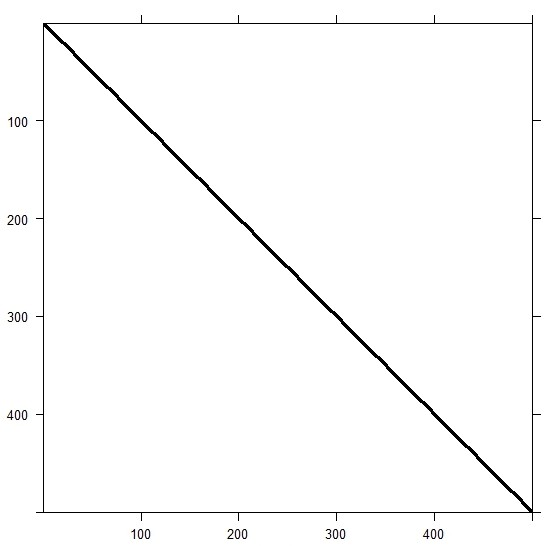
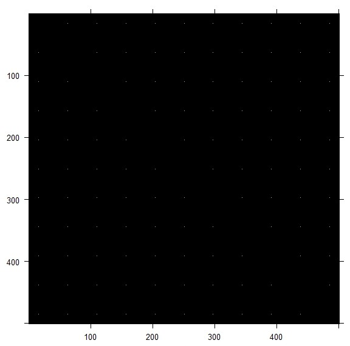
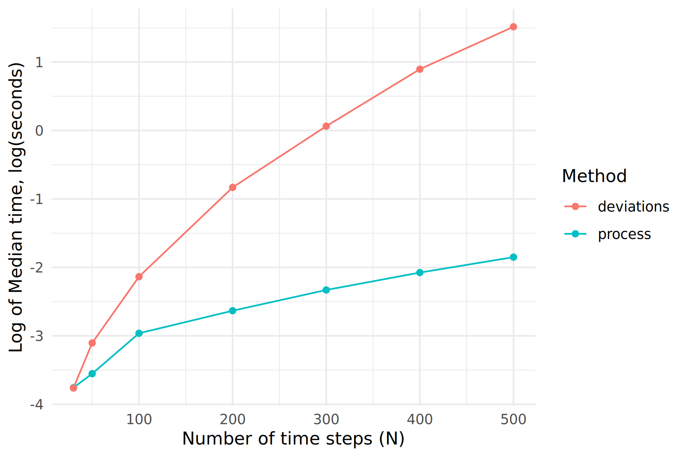
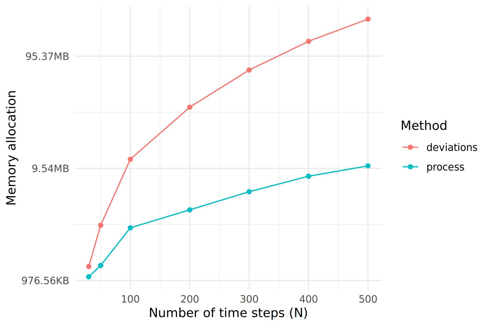
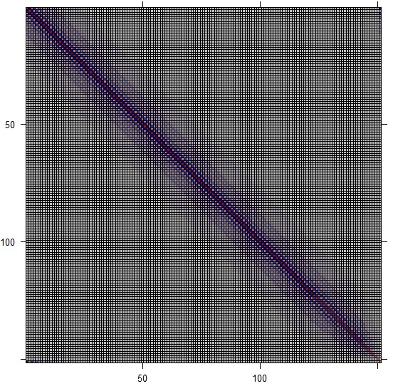
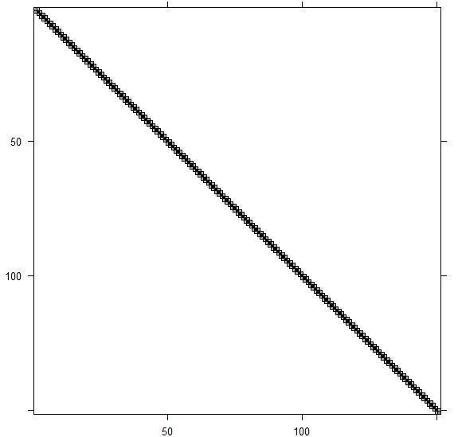

layout: true

  
```{r xaringanthemer, include=FALSE, warning=FALSE}
options(repos = c(CRAN = "https://cloud.r-project.org"))
required_pkg <- c("xaringanthemer", "remotes", "DiagrammeR")
pkg_to_install <- required_pkg[!(required_pkg %in%
                                   installed.packages()[, "Package"])]
if (length(pkg_to_install)) install.packages(pkg_to_install)
lapply(required_pkg, library, character.only = TRUE)

if (!"nmfspalette" %in% installed.packages()[, "Package"]) {
  remotes::install_github("nmfs-ost/nmfspalette")
}
library(nmfspalette)

style_xaringan(

  base_font_size = "15px",
  text_font_size = "1.5rem",

  title_slide_background_color = unname(nmfs_cols("deep_sea_blue")),
  title_slide_text_color = unname(nmfs_cols("white")),
  title_slide_background_size = "cover",
  title_slide_background_image = file.path("static", "slideswooshver.png"),

  background_image = file.path("static", "slideswoosh_16_9.PNG"),
  background_size = "contain",
  background_color = unname(nmfs_cols("white")),

  header_font_google = google_font("Arimo"),
  header_color = unname(nmfs_cols("reflexblue")),

  text_color = unname(nmfs_cols("deep_sea_blue")),
  # text_font_google = google_font("Carlito", "300", "300i"),
  text_slide_number_color = unname(nmfs_cols("lightteal")),

  code_font_google = google_font("Source Code Pro"),
  code_highlight_color = unname(nmfs_cols("medteal")),

  inverse_background_color = unname(nmfs_cols("processblue")),
  inverse_text_color = unname(nmfs_cols("supltgray")),

  footnote_font_size = "0.8em",
  footnote_color = unname(nmfs_cols("reflexblue")),
  footnote_position_bottom = "10px",

  link_color = unname(nmfs_cols("waves")),


  extra_css = list(
    ".remark-slide-number" = list(
      "font-size" = "0.4em",
      "font-weight" = "bold",
      "margin" = "0px 840px -2px 0px"),

      ".title-slide h1" = list(
        "text-align" = "center",
        "font-weight" = "bold",
        "font-family" = "Raleway"
      ),

    ".title-slide h2" = list(
      "text-align" = "center",
      "font-weight" = "normal",
      "font-family" = "Raleway"
    ),

    ".title-slide h1, h2, h3" = list(
      "text-align" = "center",
      "padding-left" = "250px"
      ), 
    
    ".hyperlink-style" = list(
      "color" = "blue",
      "text-decoration" = "underline"
    ),

    ".center" = list(
      "display" = "flex",
      "flex-direction" = "column",
      "align-items" = "center",
      "justify-content" = "center",
      "text-align" = "center"
    ),

    ".priority-grid" = list(
      "display" = "grid",
      "grid-template-columns" = "repeat(2, minmax(0, 1fr))",
      "gap" = "12px",
      "margin-top" = "8px"
    ),

    ".priority-card" = list(
      "display" = "flex",
      "align-items" = "flex-start",
      "gap" = "10px",
      "padding" = "10px 12px",
      "background" = "rgba(243, 248, 252, 0.96)",
      "border-left" = "6px solid #0077b6",
      "border-radius" = "10px",
      "box-shadow" = "0 3px 8px rgba(0, 36, 64, 0.18)"
    ),

    ".priority-card--wide" = list(
      "grid-column" = "1 / -1",
      "border-left" = "6px solid #00a6a6",
      "background" = "rgba(230, 247, 247, 0.98)"
    ),

    ".priority-card--accent" = list(
      "border-left" = "6px solid #005f8a",
      "background" = "rgba(232, 242, 250, 0.98)"
    ),

    ".priority-card--you" = list(
      "grid-column" = "1 / -1",
      "border-left" = "6px solid #00a6a6",
      "background" = "rgba(225, 245, 240, 0.98)"
    ),

    ".priority-icon" = list(
      "font-size" = "1.35rem",
      "line-height" = "1",
      "margin-top" = "2px"
    ),

    ".priority-title" = list(
      "font-weight" = "700",
      "margin-bottom" = "2px",
      "color" = "#003b5c"
    ),

    ".priority-detail" = list(
      "font-size" = "0.95rem",
      "line-height" = "1.2",
      "color" = "#0b3a5b"
    ),

    
    ".quote-card" = list(
      "width" = "75%",
      "position" = "relative",
      "margin" = "1.2rem auto",
      "padding" = "1.1rem 1.2rem 0.9rem 1.4rem",
      "border-left" = "6px solid #0077b6",
      "background" = "rgba(240, 248, 252, 0.96)",
      "border-radius" = "10px",
      "box-shadow" = "0 4px 10px rgba(0, 36, 64, 0.14)",
      "font-style" = "italic",
      "line-height" = "1.35"
    ),

    ".quote-card::before" = list(
      "content" = "“",
      "position" = "absolute",
      "left" = "0.55rem",
      "top" = "-0.2rem",
      "font-size" = "2rem",
      "font-style" = "normal",
      "font-weight" = "700",
      "color" = "#005f8a",
      "opacity" = "0.8"
    ),

    ".quote-card::after" = list(
      "content" = "”",
      "position" = "absolute",
      "right" = "0.55rem",
      "bottom" = "-0.35rem",
      "font-size" = "2rem",
      "font-style" = "normal",
      "font-weight" = "700",
      "color" = "#005f8a",
      "opacity" = "0.8",
      "line-height" = "1"
    ),

    ".quote-attrib" = list(
      "margin-top" = "0.55rem",
      "font-style" = "normal",
      "font-weight" = "700",
      "font-size" = "0.78em",
      "color" = "#144c6e"
    ),

    ".join-wrap" = list(
      "display" = "grid",
      "grid-template-columns" = "1.05fr 0.95fr",
      "gap" = "16px",
      "align-items" = "start",
      "margin-top" = "10px"
    ),

    ".join-pitch" = list(
      "background" = "rgba(232, 245, 252, 0.96)",
      "border-left" = "8px solid #0077b6",
      "border-radius" = "12px",
      "padding" = "14px 16px",
      "box-shadow" = "0 4px 10px rgba(0, 36, 64, 0.16)"
    ),

    ".join-headline" = list(
      "font-size" = "1.35rem",
      "font-weight" = "700",
      "line-height" = "1.2",
      "margin-bottom" = "8px",
      "color" = "#003b5c"
    ),

    ".join-sub" = list(
      "font-size" = "0.95rem",
      "line-height" = "1.25",
      "color" = "#0b3a5b",
      "margin-bottom" = "8px"
    ),

    ".join-proof" = list(
      "font-size" = "0.9rem",
      "line-height" = "1.25",
      "color" = "#144c6e",
      "font-weight" = "600"
    ),

    ".join-actions" = list(
      "display" = "grid",
      "grid-template-columns" = "1fr",
      "gap" = "10px"
    ),

    ".join-action" = list(
      "background" = "rgba(255, 255, 255, 0.98)",
      "border" = "2px solid #8ecae6",
      "border-radius" = "10px",
      "padding" = "10px 12px",
      "box-shadow" = "0 2px 8px rgba(0, 36, 64, 0.10)"
    ),

    ".join-action-title" = list(
      "font-size" = "0.95rem",
      "font-weight" = "700",
      "color" = "#003b5c",
      "margin-bottom" = "3px"
    ),

    ".join-action-detail" = list(
      "font-size" = "0.82rem",
      "line-height" = "1.2",
      "color" = "#245576"
    ),

    ".join-footer" = list(
      "margin-top" = "8px",
      "font-size" = "0.85rem",
      "font-weight" = "700",
      "color" = "#0077b6"
    ),

    ".left-68" = list(
      "width" = "68%",
      "float" = "left"
    ),

    ".right-32" = list(
      "width" = "32%",
      "float" = "right"
    ),

    ".narrowtopbottommargin" = list(
      "margin-top" = "-12px",
      "margin-bottom" = "-12px"
    )
  )
)
```

.footnote[U.S. Department of Commerce | National Oceanic and Atmospheric Administration | National Marine Fisheries Service]


<style type="text/css">

code.cpp{
  font-size: 20px;
}
code.r{
  font-size: 20px;
}
code.Rcpp{
  font-size: 20px;
}


</style>


```{r setup, include=FALSE}
options(htmltools.dir.version = FALSE)
```

<!-- Start of slides -->


---
# Outline

- Hierarchical Modeling in Stock Assessments

- Guiding Principles in Design

- C++ architecture

- User Interface

- Informing Decisions via Sparsity Analysis

- Future Development Plans

---

# Hierarchical Modeling in Stock Assessments

<br>
<br>
.center[
.large[

$Index \sim LogNormal(\hat{\mathbf{I}}, \sigma_{I})$

<br>

$\hat{\mathbf{I}} = f(Growth, Maturity, Mortality, \mathbf{Recruitment}, Selectivity)$

<br>

$\log(\mathbf{Recruitment}) \sim Normal(\log(\hat{R}), \sigma_{R})$
]]


---

# Fitting Hierarchical Models: Speed vs. Accuracy


.pull-left[
**Penalized likelihood**
- Fixed effects estimation (fastest)
- Uses a Constrained optimization approach

**Laplace approximation**
- Random effects estimation (moderate)
- Uses 2nd-order Taylor series approximation

**MCMC**
  - Full posterior sampling (slowest)
  - Asymptotically exact posterior
]

.pull-right[
```{r, echo = FALSE, warning = FALSE, message = FALSE, fig.width = 10, fig.height = 9}
library(ggplot2)

methods <- data.frame(
  name = c("MCMC", "Laplace\nApproximation", "Penalized\nLikelihood"),
  x_speed = c(.8, 2.6, 4),      # Speed increases to the right
  y_accuracy = c(4, 2.4, 1),   # Accuracy increases upward
  label = c("Exact\nSlow", "2nd-order Approximation\nModerate", "Contrained Optimization\nFast")
)

curve_data <- data.frame(x = seq(1, 4, length.out = 100))
curve_data$y <- 4 / curve_data$x

ggplot(methods, aes(x = x_speed, y = y_accuracy)) +
  geom_line(
    data = curve_data,
    aes(x = x, y = y),
    linetype = "dashed",
    color = "gray60",
    linewidth = 1
  ) +
  geom_text(aes(label = name), vjust = -0.5, size = 7, fontface = "bold") +
  geom_text(aes(label = label), vjust = 1, size = 6, color = "gray30") +
  scale_x_continuous(
    expand = expansion(mult = 0.2),
    breaks = c(1, 4),
    labels = c("Slower", "Faster")
  ) +
  scale_y_continuous(
    expand = expansion(mult = 0.2),
    breaks = c(1, 4),
    labels = c("Lower", "Higher")
  ) +
  labs(x = "Computational Speed", y = "Estimation Accuracy") +
  theme_bw() +
  theme(
    legend.position = "none",
    panel.border = element_blank(),
    axis.line.x = element_line(linewidth = 0.5, linetype = "solid", colour = "black"),
    axis.line.y = element_line(linewidth = 0.5, linetype = "solid", colour = "black"),
    axis.text.x = element_text(size = 20),
    axis.text.y = element_text(size = 20),
    axis.title.x = element_text(size = 20),
    axis.title.y = element_text(size = 20)
  ) +
  coord_cartesian(ylim = c(1, 3.8), xlim = c(1, 4.2))
```
]

---
# FIMS Random Effects Requirements
<br><br>

- Include random effects option for fitting state-space models

- Temporal and spatial varying random effects

- Capture process variability and measurement error

- Shared parameterizations across fleets and populations

- Multivariate random effects

- Hierarchical estimation across processes, species, areas, etc.

---
# Guiding Principles in Design
<br><br>

- Generic and Flexible

- Extensible

- Separate the biological math from the statistics

- Dependency on TMB and access to the Laplace Approximation
---
# Choosing the default
<br><br>

.center[
.quote-card[
Unbiased estimation of parameter deviations (such as recruitment or selectivity) <br>in models without random effects requires iterative bias adjustment algorithms <br>which are inefficient and prone to error.
]
]

<br>
&emsp;&emsp;&emsp;&emsp;&emsp; ~ FIMS Requirements Documents
---
.large[**Decoupling Biological Processes from Statistical Likelihood**]
```{r, echo=FALSE, message=FALSE, warning=FALSE}
DiagrammeR::grViz("
digraph fims {
  # Global settings
  graph [rankdir=LR, bgcolor='transparent', compound=true, nodesep=0.5, ranksep=0.6]
  node [shape=box, style='filled, rounded', color='#5b8db8', fillcolor='#f0f7ff', fontname='Arial', fontcolor='#333333', fontsize=28, width=2.5, height=0.8]
  edge [color='#666666', arrowhead=vee, penwidth=1.2, fontsize = 24]

  # User Layer
  subgraph cluster_user {
    label='User Layer'; fontname='Arial-Bold'; fontcolor='#5b8db8'; style='dashed'; color='#5b8db8'; fontsize = 28;
    node [fillcolor='#e1f5fe', color='#01579b']
    A [label='R User Interface']
  }

  # Central Dispatch
  subgraph cluster_logic {
    label='Central Dispatch'; fontname='Arial-Bold'; fontcolor='#c88a2a'; style='dashed'; color='#c88a2a'; fontsize = 28;
    node [fillcolor='#fff3e0', color='#e65100']
    B [label='Rcpp Interface']
    C [label='FIMS.cpp']
    D [label='Information']
  }

  # Calculation Engine
  subgraph cluster_engine {
    label='Calculation Engine'; fontname='Arial-Bold'; fontcolor='#4f9a63'; style='dashed'; color='#4f9a63'; fontsize = 28;
    node [fillcolor='#e8f5e9', color='#2e7d32']
   
    E [label='Population Dynamics']
    H [label='Catch-At-Age']
    F [label='Distributions']
    J [label='Data']
  }

  # Results
  subgraph cluster_results {
    label='Results'; fontname='Arial-Bold'; fontcolor='#b85a7a'; style='dashed'; color='#b85a7a'; fontsize = 28;
    node [fillcolor='#fce4ec', color='#880e4f', fontsize = 24]
    G [label='model.hpp']
    I [label='Negative Log-Likelihood']
  }

  # Layout constraints (forcing order)
  {rank=same; B C}
  {rank=same; E H F J}

  # Edges
  A -> B
  A -> C
  B -> D
  D -> E
  D -> H

  D -> F
  D -> J 
  
  J -> F [constraint=false, style=solid]
  E -> H
  
  # Grouping the outputs to model.hpp
  {H F} -> G
  C -> G
  G -> I
  
  # Feedback loops (using 'constraint=false' so they don't mess up the LR flow)
  I -> C [constraint=false, style=dotted, label='value/gradient', fontsize = 28]
}
", width = "100%", height = "85%")
```
---
# Globally Available Variable Map
<br><br>

```cpp
std::unordered_map<uint32_t, fims::Vector<Type>*> variable_map;
```

uint32_t: Parameter's unique ID<br>
fims::Vector<Type>*: pointer to a FIMS vector
<br><br>

C++ map that stores pointers to all model parameters at the global scope

---
# Globally Available Variable Map

```cpp
std::unordered_map<uint32_t, fims::Vector<Type>*> variable_map;
```

.midi[
uint32_t: Parameter's unique ID<br>
fims::Vector<Type>*: pointer to a FIMS vector
<br>


.pull-left[
**Rcpp Interface** <br>Populates the variable map with pointers to all model parameters, including random effects.<br><br>
**Information** <br>Stores the variable map, which is accessible across all C++ files. <br><br>
**Distributions** <br>Accesses the variable map to compute likelihood contributions. 
]]

---
# Globally Available Variable Map

```cpp
std::unordered_map<uint32_t, fims::Vector<Type>*> variable_map;
```

.midi[
uint32_t: Parameter's unique ID<br>
fims::Vector<Type>*: pointer to a FIMS vector
<br>


.pull-left[
**Rcpp Interface** <br>Populates the variable map with pointers to all model parameters, including random effects.<br><br>
**Information** <br>Stores the variable map, which is accessible across all C++ files. <br><br>
**Distributions** <br>Accesses the variable map to compute likelihood contributions. 
]

.pull-right[
**Prior Likelihood**<br>
observed_value -> parameter 
<br><br>
**Random Effects Likelihood**<br>
observed_value -> random effect parameter<br>
expected_value -> derived quantity (or vector of 0s)
<br><br>
**Data Likelihood**<br>
observed_value -> data vector<br>
expected_value -> derived quantity 
]]
---
# Connecting Random Effects to TMB

```{r, eval = FALSE}
recruitment$log_devs[i]$set_estimation_type("random_effects")
```

In the Rcpp Interface, if a parameter's estimation type is set to "random_effects":
- The parameter gets added to the global `random_effects_parameters` vector.
- An R function returns the list of random effects parameters for a model.
- The random effects list is passed into FIMS.cpp through MakeADFun and is linked
   to the global `random_effects_parameters` vector.

```{r, eval = FALSE}
parameters <- list(
    p = get_fixed(),
    re = get_random()
  )
  obj <- TMB::MakeADFun(
    data = list(), parameters, DLL = "FIMS",
    silent = TRUE, map = map, random = "re"
  )
```

---

# Default FIMS Model

```{r, eval = FALSE}
library(FIMS)
# Prepare the package data for being used in a FIMS model
data("data_big")
data_4_model <- FIMSFrame(data_big)

# Set up the default configurations and parameters for the model
default_configurations <- 
  create_default_configurations(data = data_4_model)
default_parameters <- create_default_parameters(
  configurations = default_configurations,
  data = data_4_model
)

# run the model
fit <- default_parameters |>
  initialize_fims(data = data_4_model) |>
  fit_fims(optimize = TRUE)
```

---
# Recruitment Deviations are random effects by default

```{r, echo = FALSE}
library(FIMS)
data("data_big")
data_4_model <- FIMSFrame(data_big)

# Default configurations and parameters for the model
default_configurations <- 
  create_default_configurations(
    data = data_4_model)
default_parameters <- 
  create_default_parameters(
    configurations = default_configurations,
    data = data_4_model
)
options(width = 150)
```


```{r}

default_parameters |> 
  tidyr::unnest(cols = data) |>
  dplyr::filter(
    label == "log_devs"
  ) 
```

---
# Change to fixed effect
Estimate with constrained optimization (penalized likelihood)
```{r, eval = FALSE}
# set estimation_type of log_devs to fixed_effects
default_parameters <- default_parameters |>
  tidyr::unnest(cols = data) |>
  dplyr::mutate(
    estimation_type = ifelse(label == "log_devs", 
      "fixed_effects", estimation_type)
  )
# fix Recruitment Distribution log_sd to "constant"
default_parameters <- default_parameters |>
  dplyr::mutate(
    estimation_type = ifelse(label == "log_sd" & 
        module_name == "Recruitment", 
      "constant", estimation_type)
  )
```
---
# Upcoming User Interface Enhancements

New helper functions to set random effects for any process (GitHub Issue [#1235](https://github.com/NOAA-FIMS/FIMS/issues/1235))
<br>
```{r, eval = FALSE}
add_process(
  module_name = “selectivity”,
  fleet_name = “fleet1”,
  specification_type = “semi_parametric”,
  strucutre = “AR1”,
  base_function = “logistic”,
  logit_rho = 0)


add_priors(
    fleet = c(fleet1, fleet2),
    module = selectivity,
    slope ~ normal(1.5, 10),
    inflection_point ~ normal(2, 10)
)
```

---
# Advanced User Implementation
```{r, eval = FALSE}
# Create a recruitment module
recruitment <- new(BevertonHoltRecruitment)

# Set the log_devs parameter to be estimated as random effects
recruitment$log_devs$resize(n_years - 1)
recruitment$log_devs$set_all_random(TRUE)

# Set up a recruitment distribution module
recruitment_distribution <- methods::new(DnormDistribution)
recruitment_distribution$expected_values$resize(n_years - 1)
recruitment_distribution$log_sd[1]$set_estimation_type("fixed_effects")

# Link the observed values of the recruitment_distribution
# to the log_devs parameter vector
recruitment_distribution$set_distribution_links("process", 
  recruitment$log_devs$get_id())

```
🚧 : The `set_distribution_links` function is being refactored in GitHub Issue [#1194](https://github.com/NOAA-FIMS/FIMS/issues/1194)


---
# Sparse parameterization of recruitment

$$
\begin{align}
log\_r &\sim Normal(\widehat{log\_r}, \sigma_{r})\\
\widehat{log\_r} &= log(BevertonHolt(SSB, parameters))
\end{align}
$$
```{r, eval = FALSE}
# Create a recruitment module
recruitment <- new(BevertonHoltRecruitment)

# Set the log_devs parameter to be estimated as random effects
recruitment$log_r$resize(n_years - 1)
recruitment$log_r$set_all_random(TRUE)

# Set up a recruitment distribution module
recruitment_distribution <- methods::new(DnormDistribution)
recruitment_distribution$log_sd[1]$set_estimation_type("fixed_effects")

# Link the observed values of the recruitment_distribution
# to the log_r parameter vector and log_expected_recruitment derived quantity
recruitment_distribution$set_distribution_links("process", 
  c(recruitment$log_r$get_id(), recruitment$log_expected_recruitment$get_id()))
```
---
# Hessian Inversion with the Cholesky Factorization

To avoid the computational burden of a full matrix inversion, we use the Cholesky Factorization 

$$
H = LL^T\mathrm{~where~} L \mathrm{~is~a~lower~triangular~matrix}
$$ 

.pull-left[.large[**Penalized Likelihood**]
<br><br>
.left[
- Uses the Cholesky factor, $L$, to calculate the Variance-Covariance matrix **once** at the MLE for uncertainty estimation

]
]


.pull-right[.large[**Laplace Approximation**]
<br>
.left[
- Uses the Cholesky factor, $L$, to evaluate the Marginal Likelihood during **every iteration** of the optimizer
]]
<br><br><br>
**This factorization is efficient but its performance depends entirely on matrix structure**
---

# The Scalability Bottleneck
<br>


.large[The ] $\Large{O(n^3)}$ .large[ wall]

<br>
.large[
- Dense Cholesky factorization scales at $O(n^3)$
<br><br>
- In the Laplace Approximation this cost is paid at **every iteration**
<br><br>
- To move beyond moderate-sized models, we must exploit **Sparsity**]

---
# Sparsity and TMB
- Laplace Approximation requires the **Cholesky factorization** of the Hessian at **every iteration**
<br><br>
- Template Model Builder (TMB) makes this fast by taking advantage of **sparsity**
<br><br>
- After building the **static** computational graph, TMB **automatically detects** sparseness and **optimizes** the tape by removing operations involving constants of $0$
<br><br>
- When evaluating the Laplace Approximation, TMB uses the **sparse Cholesky factorization**, which eliminates all $0$ calculations
<br><br><br>
$O(n^3)$: Dense Hessian <br>
$O(n^{3/2})$: Sparse Spatial Hessian (GMRF / 2D Grid)  
$O(n)$: Sparse Time Series Hessian (AR1, RW / 1D)
---
# Parameterization affects sparsity of Hessian

.mylarge[
**AR1 model:** $x_t = \phi x_{t-1} + w_t$]

.pull-left[
**Process Parameterization**  

$x_t \sim N(\phi x_{t-1}, \sigma^{2}_{x})$
<br>

```{r, echo = FALSE, fig.alt = "Hessian under the Process Parameterization", out.width = "40%"}

```

Sparse Hessian, Cholesky factorization: $O(n)$
]

.pull-right[
** Deviations Parameterization**  

.narrowtopbottommargin[
$x_{t} = \phi x_{t-1} + \sigma_x w_{t}$<br>
$w_{t} \sim N(0,1)$]

```{r, echo = FALSE, fig.alt = "Hessian under the Deviations Parameterization", out.width = "39%"}

```

.normal[
Dense Hessian, Cholesky factorization: $O(n^3)$]
]

$w_t$ is white noise and $\phi \neq 0$ for an order-_1_ process

---
# Benchmarking AR1
.pull-left[
  Speed<br>
```{r, echo = FALSE, fig.alt = "Benchmarking the speed of AR1 Parameterizations", out.width = "100%"}

```
]

.pull-right[
  Memory<br>
```{r, echo = FALSE, fig.alt = "Benchmarking the memory of AR1 Parameterizations", out.width = "100%"}

```
]
---
# Applications in Stock Assessments

.pull-left[
**Case Study: Catch-at-age Model**

- Models fit using a modified **babySAM** in RTMB
<br><br>
- Recruitment, Numbers at Age, and Fishing Mortality are AR1 processes
<br><br>
- **Focus:** Comparing parameterizations in Recruitment
]

.pull-right[
**Parameterizing Recruitment**<br>

**Process:**
\begin{aligned}
log(\widehat{N_{y,1}}) &= log(N_{y-1,1})\\
log(N_{y,1}) &\sim Normal(\bar{r} + \phi(log(\widehat{N_{y,1}}) - \bar{r}), \sigma^{2}_{r})
\end{aligned}


**Deviations:**
.narrowtopmargin[
\begin{aligned}
z_{1} &\sim Normal\big(0, \sqrt{\sigma_{r}^{2}/(1 - \phi^2)}\big)\\
z_{2:n} &\sim Normal(0, \sigma_{r})\\
dev_{1} &= z_{1}\\
dev_{y} &= \phi dev_{y-1} + z_{y}\\
log(N_{y,1}) &= \bar{r} + dev_{y}
\end{aligned}
]]

---
# Speed and Memory Test Results

- Relative results from 100 interactions using `bench::mark`
- Model fit $n=45$ years of recruitment 

<br>


|Intercept|Model       |Relative time difference |Relative memory allocation  |
|---------|------------|-------------------------|----------------------------|
|Y        |**process** |**1**                    |**1**                       |
|N        |**process** |**1**                    |**1**                       |
|Y        |deviations  |1.4                      |1.4                         |
|N        |deviations  |1.6                      |1.4                         |


<br>
At these sample sizes, the ~**1.5x speedup** reflects the reduction in the recruitment block's computational cost. The true $O(n^3)$ "wall" becomes more visible as model scales up in complexity


---
# Moving average (MA) models


**MA1 model:** $x_t = w_t + \theta w_{t-1}$
.pull-left[
**Process Parameterization**  

$w_{t} = x_{t} - \theta w_{t-1}$<br>
$w_t \sim N(0, \sigma_{x})$<br>
$y_{t} \sim N(x_{t}, \sigma_{y})$<br>
where $w$ and $x$ are treated as random

```{r, echo = FALSE, fig.alt = "Hessian under the Process Parameterization", out.width = "40%"}

```

]
.pull-right[
** Deviations Parameterization**  

$w_t \sim N(0, \sigma_{w})$<br>
$x_{t} = w_{t} + \theta w_{t-1}$<br>
$y_{t} \sim N(x_{t}, \sigma_{y})$<br>
where $w$ is treated as random

```{r, echo = FALSE, fig.alt = "Hessian under the Deviations Parameterization", out.width = "40%"}

```

]
---
# Next Generation Models
<br>
.large[
- **Recommendation**: 
  - **AR1**: process approach
  - **MA1**: deviations approach
<br><br>
- No universal best parameterization but **optimal sparsity** depends on model structure
<br><br>
- For next gen TMB models, **good practices in efficiency and inference** should be evaluated through the lens of the Laplace Approximation
]
---
# Future FIMS RE Development Goals
<br>
.large[
- Add a generic **ARn** distribution (Issue [#582](https://github.com/NOAA-FIMS/FIMS/issues/582))
<br><br>
- Add multivariate functionality 
  - **GMRF** distribtion (Issue [#582](https://github.com/NOAA-FIMS/FIMS/issues/582))
  - Ability to set **multivariate pointers**
  <br><br>
- Fully develop **non-parametric** and **semi-parametric** functionality for all time-varying parameters 
  - Age-based selectivity Issue [#1206](https://github.com/NOAA-FIMS/FIMS/issues/1206)
  <br><br>
- Refactor **Numbers At Age** with random effect capability
<br><br>
- Add OSA residuals (Issue [#546](https://github.com/NOAA-FIMS/FIMS/issues/546))
]
---
# Summary
<br>
.large[
- FIMS Random Effects are designed to be **generic**, **flexible**, and **extensible**
  <br><br>
- FIMS keep the biological math **separate** from the statistical likelihood 
  <br><br>
- The global **variable map** allows any **parameter** or **derived quantity** to be linked to random effect distributions
  <br><br>
- The current **default model** fits recruitment deviations as **random effects** with a Normal iid distribution
]

---
# &#x1F44B; Thank you!

<div style="text-align: center;">
  
</div>

&#x1F4E9; andrea.havron@noaa.gov


