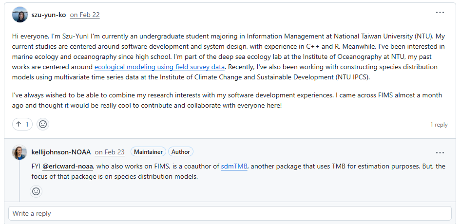
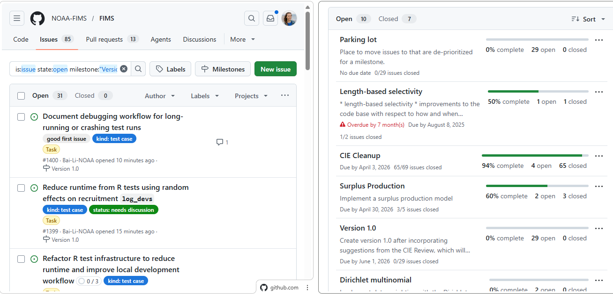
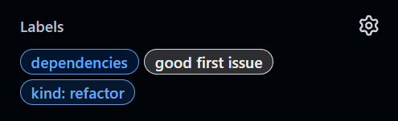
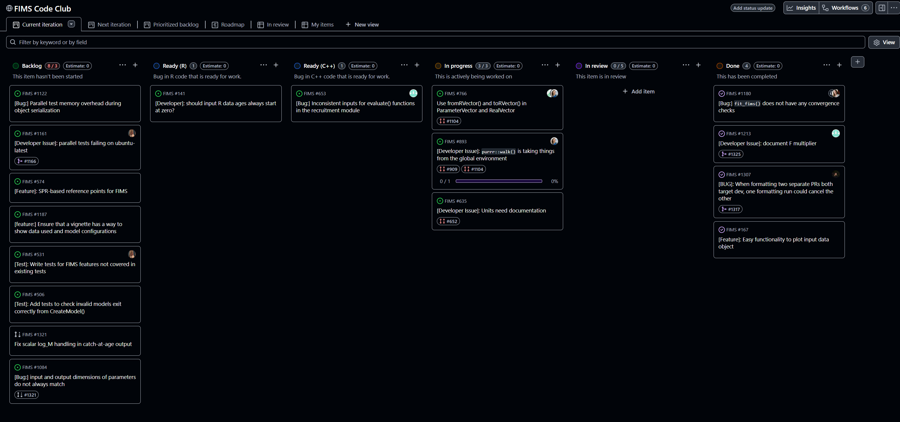

layout: true
  
```{r xaringanthemer, include=FALSE, warning=FALSE}
options(repos = c(CRAN = "https://cloud.r-project.org"))
required_pkg <- c("xaringanthemer", "remotes", "webshot2", "xfun", "DiagrammeR", "FIMS", "ggrepel")
pkg_to_install <- required_pkg[!(required_pkg %in%
                                   installed.packages()[, "Package"])]
if (length(pkg_to_install)) install.packages(pkg_to_install)
lapply(required_pkg, library, character.only = TRUE)

if (!"nmfspalette" %in% installed.packages()[, "Package"]) {
  remotes::install_github("nmfs-ost/nmfspalette")
}
library(nmfspalette)

style_xaringan(

  base_font_size = "15px",
  text_font_size = "1.5rem",

  title_slide_background_color = unname(nmfs_cols("darkblue")),
  title_slide_text_color = unname(nmfs_cols("white")),
  title_slide_background_size = "cover",
  title_slide_background_image = file.path("static", "slideswooshver.png"),

  background_image = file.path("static", "slideswoosh.PNG"),
  background_size = "cover",
  background_color = unname(nmfs_cols("white")),

  header_font_google = google_font("Arimo"),
  header_color = unname(nmfs_cols("darkblue")),

  text_color = unname(nmfs_cols("darkblue")),
  # text_font_google = google_font("Carlito", "300", "300i"),
  text_slide_number_color = unname(nmfs_cols("lightteal")),

  code_font_google = google_font("Source Code Pro"),
  code_highlight_color = unname(nmfs_cols("medteal")),

  inverse_background_color = unname(nmfs_cols("processblue")),
  inverse_text_color = unname(nmfs_cols("supltgray")),

  footnote_font_size = "0.6em",
  footnote_color = unname(nmfs_cols("darkblue")),
  footnote_position_bottom = "10px",

  link_color = unname(nmfs_cols("medteal")),


  extra_css = list(
    ".remark-slide-number" = list(
      "font-size" = "0.4em",
      "font-weight" = "bold",
      "margin" = "0px 840px -2px 0px"),

    ".title-slide h1, h2, h3" = list(
      "text-align" = "right"), 
    
    ".hyperlink-style" = list(
      "color" = "blue",
      "text-decoration" = "underline"
    ),

    ".priority-grid" = list(
      "display" = "grid",
      "grid-template-columns" = "repeat(2, minmax(0, 1fr))",
      "gap" = "12px",
      "margin-top" = "8px"
    ),

    ".priority-card" = list(
      "display" = "flex",
      "align-items" = "flex-start",
      "gap" = "10px",
      "padding" = "10px 12px",
      "background" = "rgba(243, 248, 252, 0.96)",
      "border-left" = "6px solid #0077b6",
      "border-radius" = "10px",
      "box-shadow" = "0 3px 8px rgba(0, 36, 64, 0.18)"
    ),

    ".priority-card--wide" = list(
      "grid-column" = "1 / -1",
      "border-left" = "6px solid #00a6a6",
      "background" = "rgba(230, 247, 247, 0.98)"
    ),

    ".priority-card--accent" = list(
      "border-left" = "6px solid #005f8a",
      "background" = "rgba(232, 242, 250, 0.98)"
    ),

    ".priority-card--you" = list(
      "grid-column" = "1 / -1",
      "border-left" = "6px solid #00a6a6",
      "background" = "rgba(225, 245, 240, 0.98)"
    ),

    ".priority-icon" = list(
      "font-size" = "1.35rem",
      "line-height" = "1",
      "margin-top" = "2px"
    ),

    ".priority-title" = list(
      "font-weight" = "700",
      "margin-bottom" = "2px",
      "color" = "#003b5c"
    ),

    ".priority-detail" = list(
      "font-size" = "0.95rem",
      "line-height" = "1.2",
      "color" = "#0b3a5b"
    ),

    ".join-wrap" = list(
      "display" = "grid",
      "grid-template-columns" = "1.05fr 0.95fr",
      "gap" = "16px",
      "align-items" = "start",
      "margin-top" = "10px"
    ),

    ".join-pitch" = list(
      "background" = "rgba(232, 245, 252, 0.96)",
      "border-left" = "8px solid #0077b6",
      "border-radius" = "12px",
      "padding" = "14px 16px",
      "box-shadow" = "0 4px 10px rgba(0, 36, 64, 0.16)"
    ),

    ".join-headline" = list(
      "font-size" = "1.35rem",
      "font-weight" = "700",
      "line-height" = "1.2",
      "margin-bottom" = "8px",
      "color" = "#003b5c"
    ),

    ".join-sub" = list(
      "font-size" = "0.95rem",
      "line-height" = "1.25",
      "color" = "#0b3a5b",
      "margin-bottom" = "8px"
    ),

    ".join-proof" = list(
      "font-size" = "0.9rem",
      "line-height" = "1.25",
      "color" = "#144c6e",
      "font-weight" = "600"
    ),

    ".join-actions" = list(
      "display" = "grid",
      "grid-template-columns" = "1fr",
      "gap" = "10px"
    ),

    ".join-action" = list(
      "background" = "rgba(255, 255, 255, 0.98)",
      "border" = "2px solid #8ecae6",
      "border-radius" = "10px",
      "padding" = "10px 12px",
      "box-shadow" = "0 2px 8px rgba(0, 36, 64, 0.10)"
    ),

    ".join-action-title" = list(
      "font-size" = "0.95rem",
      "font-weight" = "700",
      "color" = "#003b5c",
      "margin-bottom" = "3px"
    ),

    ".join-action-detail" = list(
      "font-size" = "0.82rem",
      "line-height" = "1.2",
      "color" = "#245576"
    ),

    ".join-footer" = list(
      "margin-top" = "8px",
      "font-size" = "0.85rem",
      "font-weight" = "700",
      "color" = "#0077b6"
    ),
    
    ".left-68" = list(
      "width" = "68%",
      "float" = "left"
    ),

    ".right-32" = list(
      "width" = "32%",
      "float" = "right"
    )
  )
)
```

.footnote[U.S. Department of Commerce | National Oceanic and Atmospheric Administration | National Marine Fisheries Service]

```{r setup, include=FALSE}
options(htmltools.dir.version = FALSE)
```

<!-- Start of slides -->

---
# Outline

- Some Rationale

- &#x1F3DB;&#xFE0F; .hyperlink-style[[FIMS organization](https://noaa-fims.github.io/)] &#x1F3DB;&#xFE0F;

- The **S** in **S**ystem

- Version history of  package

- Priorities

- My Path into FIMS

- &#x1F9D1;&#x200D;&#x1F91D;&#x200D;&#x1F9D1; FIMS Family &#x1F9D1;&#x200D;&#x1F91D;&#x200D;&#x1F9D1;

---
# Some Rationale
<div>

</div>

Dowling et al. (2026; .hyperlink-style[[10.1111/faf.70076](https://doi.org/10.1111/faf.70076)]) surveyed developers of 33 fishery stock assessment tools and found:

- **91%** reported using formal version control.
- **54%** did not actively promote their tools.
- **36%** (14% self-funded, 53% non-self-funded tools) had a succession plan despite **61%** reporting training activity.
- **30%** felt their tool was trending towards being obsolete.
- **91%** of tools were generated a specific use case rather than from a general need.

These patterns support investing in shared infrastructure, explicit maintenance planning, and broader contributor participation.

---
# &#x1F3DB;&#xFE0F; FIMS Organization &#x1F3DB;&#xFE0F;

### One &#x1F3E0; for code, conversation, and collaboration

Everything for FIMS lives in one shared place, making it easy to find the code, follow discussions, and jump in.

**We use a GitHub Discussion board as the main community hub**
   1. .hyperlink-style[https://github.com/orgs/NOAA-FIMS/discussions]
   2. In place of Slack, Discord, or Google Group
   3. &#x1F9ED; Trace decisions from Discussion &#x2192; Issue &#x2192; Pull Request
   4. &#x1F44B; Introduce yourself on .hyperlink-style[[Discussion #801](https://github.com/orgs/NOAA-FIMS/discussions/801)]; currently at 52 &#x1FAB5;&#x1FAB5;

---
# Connecting People, Data, and Models

.hyperlink-style[[Discussion #801](https://github.com/orgs/NOAA-FIMS/discussions/801#discussioncomment-15892805)]


---
# &#x1F3DB;&#xFE0F; FIMS Organization &#x1F3DB;&#xFE0F;

### One &#x1F3E0; for code, conversation, and collaboration

Everything for FIMS lives in one shared place, making it easy to find the code, follow discussions, and jump in.

**Explore the GitHub organization**
   1. .hyperlink-style[https://github.com/NOAA-FIMS] stores many repositories
   2. &#x1F50D; Find code, issues, and discussions in one search
   3. &#x1F680; Reuse solutions across teams and model families
   4. &#x1F91D; Onboard contributors faster with shared context

---
# &#x1F3DB;&#xFE0F; FIMS Organization &#x1F3DB;&#xFE0F;

### How packages in the organization connect

```{r noaa-fims-architecture, echo=FALSE, out.width = "40%", crop=TRUE}
DiagrammeR::grViz("
digraph flowchart {
  node [shape = rectangle]
  A [label = 'NOAA-FIMS']
  B [label = 'FIMS', color='blue']
  BB [label = 'FIMSRTMB']
  C [label = 'fishprior']
  D [label = 'ecosystemom']
  E [label = 'ecosystemdata']
  A -> B
  A -> BB
  B -> BB
  A -> C
  A -> D
  A -> E
  D -> E
  E -> B
}
"
)
```

---
# The S in System

### FIMS connects the assessment ecosystem

.left-68[

- East/West/North/South &#x2192; shared framework
- data-limited/data-rich &#x2192; common workflow
- model inputs/model outputs &#x2192; end-to-end consistency

**Why this matters**

One system means faster collaboration, clearer handoffs, and more consistent assessments.
]

.right-32[

]

---
# Tracing milestones in the FIMS package

```{r snake-time-line, echo=FALSE, warning=FALSE, message=FALSE, dev='svg', fig.width=13, fig.height=7, out.width='100%', fig.align='center'}
x <- seq(1 * pi, -1.5 * pi, by = -0.05)
y <- sin(x)

milestones <- data.frame(
  version = c(
    "v0.0", "v0.1", "v0.2", "v0.3", "v0.4", "v0.5",
    "v0.6", "v0.7", "v0.8", "v0.9", "v0.10"
  ),
  detail = c(
    "July 2021: approval from Science Board",
    "Jul 2023: modular C++ age-structured assessment framework",
    "Dec 2023: derived quantities, uncertainties, and case studies",
    "Jan 2025: fit to lengths via age-to-length matrix",
    "Mar 2025: fit to fishery-dependent indices of abundance",
    "Jun 2025: random effects backend",
    "Jul 2025: changes to names of derived quantities",
    "Dec 2025: refactor input and output",
    "Jan 2026: projections",
    "Mar 2026: time-varying weights and random recruitment deviations",
    "Apr 2026: bug fixes in model initialization"
  )
)

milestones[["month"]] <- sub("^([A-Za-z]+)\\s+\\d{4}:.*$", "\\1", milestones[["detail"]])
milestones[["year"]] <- as.integer(sub("^[A-Za-z]+\\s+(\\d{4}):.*$", "\\1", milestones[["detail"]]))
milestones[["description"]] <- sub("^[A-Za-z]+\\s+\\d{4}:\\s*", "", milestones[["detail"]])
milestones[["month_num"]] <- match(
  tolower(substr(milestones[["month"]], 1, 3)),
  tolower(month.abb)
)
milestones[["date"]] <- as.Date(
  sprintf("%04d-%02d-01", milestones[["year"]], milestones[["month_num"]])
)

date_to_x <- function(date_value, min_date, max_date, x_top, x_bottom) {
  scaled <- (as.numeric(date_value) - as.numeric(min_date)) /
    (as.numeric(max_date) - as.numeric(min_date))
  x_top + scaled * (x_bottom - x_top)
}

x_top <- max(x) - 0.2
x_bottom <- min(x) + 0.2
min_date <- min(milestones[["date"]])
max_date <- max(milestones[["date"]])

milestones[["x"]] <- date_to_x(
  date_value = milestones[["date"]],
  min_date = min_date,
  max_date = max_date,
  x_top = x_top,
  x_bottom = x_bottom
)
milestones[["y"]] <- sin(milestones[["x"]])
milestones[["nudge_y"]] <- rep(c(0.95, -0.95), length.out = NROW(milestones))
milestones[["label"]] <- paste(
  milestones[["version"]],
  milestones[["description"]],
  sep = "\n"
)

year_markers <- data.frame(
  year = seq(min(milestones[["year"]]), max(milestones[["year"]]))
)
year_markers[["date"]] <- as.Date(sprintf("%04d-01-01", year_markers[["year"]]))
year_markers[["x"]] <- date_to_x(
  date_value = pmin(pmax(year_markers[["date"]], min_date), max_date),
  min_date = min_date,
  max_date = max_date,
  x_top = x_top,
  x_bottom = x_bottom
)
year_markers[["y"]] <- sin(year_markers[["x"]])
year_markers[["label_y"]] <- year_markers[["y"]] - 0.18

ggplot2::ggplot(
  data = data.frame(
    x = x,
    y = y
  ),
  ggplot2::aes(x = x, y = y)
) +
  ggplot2::geom_path(linewidth = 5, color = "#1d3557") +
  ggplot2::geom_point(
    data = milestones,
    ggplot2::aes(x = x, y = y),
    inherit.aes = FALSE,
    size = 2.1,
    color = "#1d3557"
  ) +
  ggplot2::geom_point(
    data = year_markers,
    ggplot2::aes(x = x, y = y),
    inherit.aes = FALSE,
    size = 1.3,
    color = unname(nmfspalette::nmfs_cols("processblue"))
  ) +
  ggplot2::geom_text(
    data = year_markers,
    ggplot2::aes(x = x, y = label_y, label = year),
    inherit.aes = FALSE,
    size = 8,
    color = unname(nmfspalette::nmfs_cols("processblue")),
    fontface = "bold"
  ) +
  ggrepel::geom_label_repel(
    data = milestones,
    ggplot2::aes(x = x, y = y, label = label),
    inherit.aes = FALSE,
    size = 6,
    lineheight = 0.95,
    label.padding = grid::unit(0.1, "lines"),
    label.r = grid::unit(0.15, "lines"),
    linewidth = 0.2,
    fill = unname(nmfspalette::nmfs_cols("supltgray")),
    nudge_y = milestones[["nudge_y"]],
    direction = "both",
    force = 30,
    force_pull = 0.01,
    box.padding = grid::unit(1.1, "lines"),
    point.padding = grid::unit(0.2, "lines"),
    label.size = 0.25,
    max.overlaps = Inf,
    min.segment.length = 0,
    max.iter = 20000,
    max.time = 3,
    segment.color = unname(nmfspalette::nmfs_cols("lightteal")),
    seed = 2026
  ) +
  ggplot2::coord_flip(clip = "off") +
  ggplot2::scale_y_continuous(
    expand = ggplot2::expansion(mult = c(0.8, 0.9))
  ) +
  ggplot2::theme_void() +
  ggplot2::theme(
    plot.margin = ggplot2::margin(5.5, 80, 5.5, 80)
  )
```

---
# Priorities

## How do we decide priorities?

## What are our priorities?

## How will we meet our priorities?

---
# How do we decide priorities

<div class="priority-grid">
  <div class="priority-card">
    <div class="priority-icon">&#x1F4CB;</div>
    <div>
      <div class="priority-title">Requirements</div>
      <div class="priority-detail">Maintain alignment with core project requirements.</div>
    </div>
  </div>

  <div class="priority-card">
    <div class="priority-icon">&#x1F3AF;</div>
    <div>
      <div class="priority-title">Case-Study Compatibility</div>
      <div class="priority-detail">Match features needed for ASAP, BAM, SS3, and WHAM case studies.</div>
    </div>
  </div>

  <div class="priority-card">
    <div class="priority-icon">&#x1F9EA;</div>
    <div>
      <div class="priority-title">New Statistical Methods</div>
      <div class="priority-detail">Support adoption of new modeling and statistical approaches.</div>
    </div>
  </div>

  <div class="priority-card">
    <div class="priority-icon">&#x1F44D;</div>
    <div>
      <div class="priority-title">Ease of Use</div>
      <div class="priority-detail">Improve user experience for model developers and analysts.</div>
    </div>
  </div>

  <div class="priority-card priority-card--wide">
    <div class="priority-icon">&#x1F451;</div>
    <div>
      <div class="priority-title">Benevolent Dictator</div>
      <div class="priority-detail">Final prioritization is guided by project leadership.</div>
    </div>
  </div>
</div>

---
# Wish list to match ASAP

.left-68[
  
]
.right-32[
* Sex-at-age ratio other than 0.5 (Issue #521)
* Separate weights at age for catch, spawners, etc.
* Annual timing of Index and spawning biomass calculations
* One-step-ahead residuals
* Reference points
]

---
# What are our priorities

<div class="priority-grid">

  <div class="priority-card priority-card--accent">
    <div class="priority-icon">&#x1F4C8;</div>
    <div>
      <div class="priority-title">Growth Estimation</div>
      <div class="priority-detail">Support estimation of growth dynamics within the model framework by November 2026.</div>
    </div>
  </div>

  <div class="priority-card priority-card--accent">
    <div class="priority-icon">&#x1F4AB;</div>
    <div>
      <div class="priority-title">Random effects</div>
      <div class="priority-detail">Add auto-regressive structure and friendly user interface by August 2026.</div>
    </div>
  </div>

  <div class="priority-card priority-card--accent">
    <div class="priority-icon">&#x1F328;&#xFE0F;</div>
    <div>
      <div class="priority-title">Cloud ready</div>
      <div class="priority-detail">Cloud environments with FIMS installed by September 2026.</div>
    </div>
  </div>

  <div class="priority-card priority-card--accent">
    <div class="priority-icon">&#x27BF;</div>
    <div>
      <div class="priority-title">Dynamic Structural Equation Modeling</div>
      <div class="priority-detail">Add DSEM capabilities by December 2026.</div>
    </div>
  </div>

  <div class="priority-card priority-card--accent">
    <div class="priority-icon">&#x1F300;</div>
    <div>
      <div class="priority-title">Additional Model Families</div>
      <div class="priority-detail">Add families such as surplus production (August 2026) and empirical dynamic models.</div>
    </div>
  </div>

  <div class="priority-card priority-card--accent">
    <div class="priority-icon">&#x2640;&#xFE0F;&#x2642;&#xFE0F;</div>
    <div>
      <div class="priority-title">Sex</div>
      <div class="priority-detail">Modeling support for sex-specific processes and data inputs.</div>
    </div>
  </div>

  <div class="priority-card priority-card--accent">
    <div class="priority-icon">&#x23F1;&#xFE0F;</div>
    <div>
      <div class="priority-title">Timing</div>
      <div class="priority-detail">Provide more granularity than beginning of the year.</div>
    </div>
  </div>

  <div class="priority-card priority-card--accent">
    <div class="priority-icon">&#x1F480;</div>
    <div>
      <div class="priority-title">Discards</div>
      <div class="priority-detail">Allow for discard fisheries.</div>
    </div>
  </div>
</div>

---
# FIMS Milestones

.pull-left[
  `is:issue state:open`<br>
  `milestone:"Version 1.0"`
]
.pull-right[
  .hyperlink-style[[`milestones?sort=due_date&`<br>`direction=asc`](https://github.com/NOAA-FIMS/FIMS/milestones?sort=due_date&direction=asc)]
]
<div style="text-align: center;">
  
</div>

---
# How will we meet our priorities

<div class="priority-grid">
  <div class="priority-card">
    <div class="priority-icon">&#x1F4BB;</div>
    <div>
      <div class="priority-title">Code Club</div>
      <div class="priority-detail">Monthly sessions to build, test, and learn together.</div>
    </div>
  </div>

  <div class="priority-card">
    <div class="priority-icon">&#x1F91D;</div>
    <div>
      <div class="priority-title">Contractors</div>
      <div class="priority-detail">Bring focused expertise to accelerate key tasks.</div>
    </div>
  </div>

  <div class="priority-card">
    <div class="priority-icon">&#x1F6E0;&#xFE0F;</div>
    <div>
      <div class="priority-title">FIMS Implementation Team</div>
      <div class="priority-detail">Coordinate integration, testing, and delivery.</div>
    </div>
  </div>

  <div class="priority-card">
    <div class="priority-icon">&#x1F393;</div>
    <div>
      <div class="priority-title">Interns</div>
      <div class="priority-detail">Google Summer of Code and other pathways for interns.</div>
    </div>
  </div>

  <div class="priority-card">
    <div class="priority-icon">&#x1F3EB;</div>
    <div>
      <div class="priority-title">University Students</div>
      <div class="priority-detail">Contribute research ideas and hands-on model development.</div>
    </div>
  </div>

  <div class="priority-card priority-card--you">
    <div class="priority-icon">&#x1F465;</div>
    <div>
      <div class="priority-title">YOU, yes you!</div>
      <div class="priority-detail">Your participation directly shapes priorities and outcomes.</div>
    </div>
  </div>
</div>

---
# My Path into FIMS

<div style="margin-top: 40px; max-width: 800px;">

<div style="font-size: 1.7rem; font-weight: 600; line-height: 1.3; margin-bottom: 16px;">
  You Can Join FIMS and Make an Impact
</div>

<div style="font-size: 1.05rem; line-height: 1.6; margin-bottom: 40px;">
You do not need to be there from the beginning to contribute meaningfully.
</div>

<div style="border-left: 4px solid #2C7FB8; padding-left: 16px; font-size: 1.02rem; line-height: 1.6;">
<strong>My path into FIMS:</strong><br><br>
I joined after the project was already underway.<br>
My first contribution was a <strong>adding alt text to figures</strong>.<br>
Within a few months, I was <strong>contributing to core modules</strong>.
</div>

<div style="margin-top: 90px; font-size: 1.2rem; font-weight: 600; text-align: center;">
  <span style="color: #2C7FB8;">There are multiple ways to contribute</span>, no matter your background.
</div>
---
# How I Got Started

This is what getting started looked like for me:

.pull-left[
<div style="margin-top: 1.0em;">

<div class="priority-title" style="font-size: 1.15rem; font-weight: 600; color: #2C7FB8; margin-bottom: 4px;">
1. Start Small
</div>
<div class="priority-detail" style="font-size: 0.96rem; margin-bottom: 26px;">
I started with “good first issues”, small bugs, and adding figure captions.
</div>

<div class="priority-title" style="font-size: 1.15rem; font-weight: 600; color: #2C7FB8; margin-bottom: 4px;">
2. Learn Together
</div>
<div class="priority-detail" style="font-size: 0.96rem; margin-bottom: 26px;">
Code Club and coworking helped me see how others approach problems.
</div>

<div class="priority-title" style="font-size: 1.15rem; font-weight: 600; color: #2C7FB8; margin-bottom: 4px;">
3. Get Feedback & Ask Questions
</div>
<div class="priority-detail" style="font-size: 0.96rem;">
PR feedback and discussion posts helped me understand workflows and improve quickly.
</div>

</div>
]

.pull-right[
<div style="text-align: center; margin-top: 2.5em;">
  
  <div style="font-size: 1.05rem; font-weight: 600; margin-top: 12px; color: #2C7FB8;">
    Look for “good first issue” labels
  </div>
</div>
]

---
# Learning While Contributing

.pull-left[
<div style="margin-top: 2em;">

<div style="font-size: 1.5rem; font-weight: 600; margin-bottom: 20px;">
When I Started:
</div>

<div style="font-size: 1.05rem; line-height: 1.6;">
- No C++ background 
<br> 
- New to stock assessment workflows
<br>
- Learning GitHub processes
</div>

</div>
]

.pull-right[
<div style="margin-top: 2em;">

<div style="font-size: 1.5rem; font-weight: 600; margin-bottom: 20px;">
Now:
</div>

<div style="font-size: 1.05rem; line-height: 1.6;">
- Contributing to core modules
<br>
- Submitting and merging PRs
<br>
- Helping shape model features
</div>

</div>
]

<div style="margin-top: 15em; text-align: center; font-size: 1.2rem; font-weight: 600; color:#2C7FB8;">
  My experience wasn’t about knowing everything, it was about getting started.
</div>

---
# FIMS is Designed to be Approachable

This is what made that possible:

- **Documentation and Vignettes** support getting started  
- **FIMS Style Guide** makes it easier to follow best practices
- **Code Club and Discussion Boards** make it easier to ask questions and get help  

<div style="width: 100%; max-width: 600px; height: 220px; overflow: hidden; margin: 10px auto;">
  
</div>

<div style="text-align: center; margin-top: 5px; font-size: 0.95rem; font-weight: 600; color: #2C7FB8;">
  Code Club project board showing what we’re actively working on and what’s coming next.
</div>

---
# Where FIMS is Going
<br>
- There's a lot of helpful documentation  
  - It is not always clear where to start...

- Work is underway to build clearer user/contributor pathways (e.g., roadmap efforts)  

<div style="position: absolute; top: 100px; right: 70px;">
  
</div>

<br>

.center[
<span style="color: #2C7FB8; font-weight: 700;">FIMS is built by its users. Be part of shaping the next generation of stock assessment.</span>
]

---
# 👩🏿‍🤝‍🧑🏻 FIMS Family 🧑🏽‍🤝‍🧑🏼

### &#x1F449; There is a place for YOU in FIMS.

Whether you code every day or are just getting started, there is a clear path to contribute and make an immediate impact. **Get involved today!**

1. &#x1F4E3; **Introduce yourself** on our .hyperlink-style[[Discussion Board #801](https://github.com/orgs/NOAA-FIMS/discussions/801)].
2. &#x1F4CC; **Post an Issue** when you find something that is not quite right, even posting about spelling mistakes is helpful.
3. &#x1F6A9; **Pick a starter task** by claiming a .hyperlink-style[[good first issue](https://github.com/NOAA-FIMS/FIMS/issues?q=state%3Aopen%20label%3A%22good%20first%20issue%22)].
4. &#x1F4BB; **Join** a .hyperlink-style[[FIMS Code Club](https://noaa-fims.github.io/about/calendar.html)] (monthly 3-hour coding/learning session).
5. &#x1F91D; **Collaborate across disciplines** and learn from stock assessment, software, and methods experts.
6. &#x2B50; **Bring novel practices** to multiple model types at once.

### Your contribution can influence how FIMS is built.

---
# &#x1F44B; Welcome to the .hyperlink-style[[FIMS](https://noaa-fims.github.io/)] Team

<div style="text-align: center;">
  
</div>

&#x1F4E9; kelli.johnson@noaa.gov
