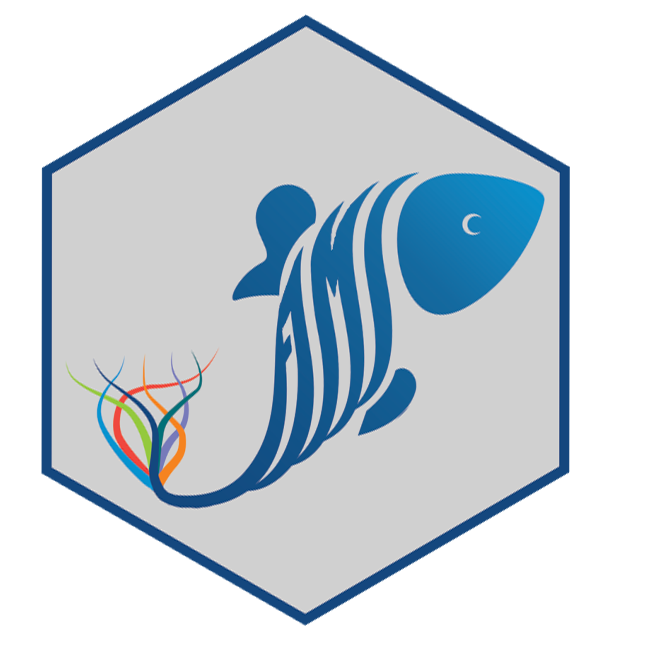
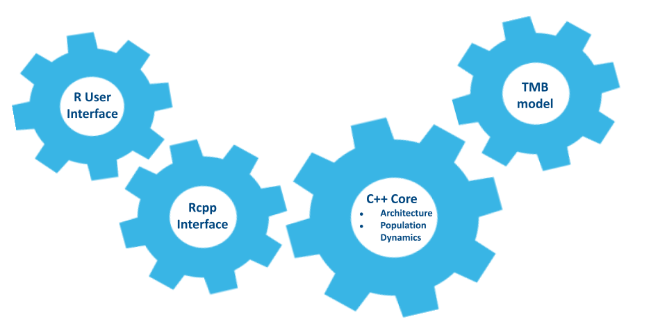

layout: true
  
```{r xaringanthemer, include=FALSE, warning=FALSE, message=FALSE}
options(repos = c(CRAN = "https://cloud.r-project.org"))
required_pkg <- c("xaringanthemer", "remotes", "webshot2", "xfun", "DiagrammeR", "FIMS", "ggrepel")
pkg_to_install <- required_pkg[!(required_pkg %in%
                                   installed.packages()[, "Package"])]
if (length(pkg_to_install)) install.packages(pkg_to_install)
lapply(required_pkg, library, character.only = TRUE)

if (!"nmfspalette" %in% installed.packages()[, "Package"]) {
  remotes::install_github("nmfs-ost/nmfspalette")
}
library(nmfspalette)
library(rvest)
library(dplyr)

style_xaringan(

  base_font_size = "15px",
  text_font_size = "1.5rem",

  title_slide_background_color = unname(nmfs_cols("darkblue")),
  title_slide_text_color = unname(nmfs_cols("white")),
  title_slide_background_size = "cover",
  title_slide_background_image = file.path("static", "slideswooshver.png"),

  background_image = file.path("static", "slideswoosh.PNG"),
  background_size = "cover",
  background_color = unname(nmfs_cols("white")),

  header_font_google = google_font("Arimo"),
  header_color = unname(nmfs_cols("darkblue")),

  text_color = unname(nmfs_cols("darkblue")),
  # text_font_google = google_font("Carlito", "300", "300i"),
  text_slide_number_color = unname(nmfs_cols("lightteal")),

  code_font_google = google_font("Source Code Pro"),
  code_highlight_color = unname(nmfs_cols("medteal")),

  inverse_background_color = unname(nmfs_cols("processblue")),
  inverse_text_color = unname(nmfs_cols("supltgray")),

  footnote_font_size = "0.6em",
  footnote_color = unname(nmfs_cols("darkblue")),
  footnote_position_bottom = "10px",

  link_color = unname(nmfs_cols("medteal")),


  extra_css = list(
    ".remark-slide-number" = list(
      "font-size" = "0.4em",
      "font-weight" = "bold",
      "margin" = "0px 840px -2px 0px"),

    ".title-slide h1, h2, h3" = list(
      "text-align" = "right"), 
    
    ".hyperlink-style" = list(
      "color" = "blue",
      "text-decoration" = "underline"
    ),

    ".priority-grid" = list(
      "display" = "grid",
      "grid-template-columns" = "repeat(2, minmax(0, 1fr))",
      "gap" = "12px",
      "margin-top" = "8px"
    ),

    ".priority-card" = list(
      "display" = "flex",
      "align-items" = "flex-start",
      "gap" = "10px",
      "padding" = "10px 12px",
      "background" = "rgba(243, 248, 252, 0.96)",
      "border-left" = "6px solid #0077b6",
      "border-radius" = "10px",
      "box-shadow" = "0 3px 8px rgba(0, 36, 64, 0.18)"
    ),

    ".priority-card--wide" = list(
      "grid-column" = "1 / -1",
      "border-left" = "6px solid #00a6a6",
      "background" = "rgba(230, 247, 247, 0.98)"
    ),

    ".priority-card--accent" = list(
      "border-left" = "6px solid #005f8a",
      "background" = "rgba(232, 242, 250, 0.98)"
    ),

    ".priority-card--you" = list(
      "grid-column" = "1 / -1",
      "border-left" = "6px solid #00a6a6",
      "background" = "rgba(225, 245, 240, 0.98)"
    ),

    ".priority-icon" = list(
      "font-size" = "1.35rem",
      "line-height" = "1",
      "margin-top" = "2px"
    ),

    ".priority-title" = list(
      "font-weight" = "700",
      "margin-bottom" = "2px",
      "color" = "#003b5c"
    ),

    ".priority-detail" = list(
      "font-size" = "0.95rem",
      "line-height" = "1.2",
      "color" = "#0b3a5b"
    ),

    ".join-wrap" = list(
      "display" = "grid",
      "grid-template-columns" = "1.05fr 0.95fr",
      "gap" = "16px",
      "align-items" = "start",
      "margin-top" = "10px"
    ),

    ".join-pitch" = list(
      "background" = "rgba(232, 245, 252, 0.96)",
      "border-left" = "8px solid #0077b6",
      "border-radius" = "12px",
      "padding" = "14px 16px",
      "box-shadow" = "0 4px 10px rgba(0, 36, 64, 0.16)"
    ),

    ".join-headline" = list(
      "font-size" = "1.35rem",
      "font-weight" = "700",
      "line-height" = "1.2",
      "margin-bottom" = "8px",
      "color" = "#003b5c"
    ),

    ".join-sub" = list(
      "font-size" = "0.95rem",
      "line-height" = "1.25",
      "color" = "#0b3a5b",
      "margin-bottom" = "8px"
    ),

    ".join-proof" = list(
      "font-size" = "0.9rem",
      "line-height" = "1.25",
      "color" = "#144c6e",
      "font-weight" = "600"
    ),

    ".join-actions" = list(
      "display" = "grid",
      "grid-template-columns" = "1fr",
      "gap" = "10px"
    ),

    ".join-action" = list(
      "background" = "rgba(255, 255, 255, 0.98)",
      "border" = "2px solid #8ecae6",
      "border-radius" = "10px",
      "padding" = "10px 12px",
      "box-shadow" = "0 2px 8px rgba(0, 36, 64, 0.10)"
    ),

    ".join-action-title" = list(
      "font-size" = "0.95rem",
      "font-weight" = "700",
      "color" = "#003b5c",
      "margin-bottom" = "3px"
    ),

    ".join-action-detail" = list(
      "font-size" = "0.82rem",
      "line-height" = "1.2",
      "color" = "#245576"
    ),

    ".join-footer" = list(
      "margin-top" = "8px",
      "font-size" = "0.85rem",
      "font-weight" = "700",
      "color" = "#0077b6"
    ),

    ".left-68" = list(
      "width" = "68%",
      "float" = "left"
    ),

    ".right-32" = list(
      "width" = "32%",
      "float" = "right"
    ),

    ".remark-slide-number" = list(
      "top" = "10px",
      "left" = "10px",
      "bottom" = "auto",
      "right" = "auto",
      "opacity" = "1"
    )
  )
)
```

.footnote[U.S. Department of Commerce | National Oceanic and Atmospheric Administration | National Marine Fisheries Service]

```{r setup, include=FALSE}
options(htmltools.dir.version = FALSE)
```

<!-- Start of slides -->

---
# Outline

- Why was FIMS created

- FIMS mission statement

- Why build FIMS now

- Software in fisheries

- Who will build the software

---
```{r get-FAQ, echo=FALSE, results='asis', warnings=FALSE}
# 1. Read the HTML from the URL
url <- "https://noaa-fims.github.io/about/faq.html"
page <- rvest::read_html(url)

# 2. Extract the text
faq_text <- page |>
  rvest::html_nodes("p") |>
  rvest::html_text(trim = TRUE)

faq_sentences <- faq_text[grepl("FIMS was created", faq_text)] |>
  strsplit("(?<=\\.)\\s+", perl = TRUE) |>
  unlist() |>
  trimws()
```

# .hyperlink-style[[Why was FIMS Created](https://noaa-fims.github.io/about/faq.html#why-is-fims-being-created)]
```{r print-FAQ-1, echo=FALSE,results='asis',warnings=FALSE}
cat(
  "<ul>",
  paste0(
    "<li>",
    xfun::html_escape(faq_sentences[3:length(faq_sentences)]),
    "</li><br>",
    collapse = ""
  ),
  "</ul>"
)
```

---
# .hyperlink-style[[Why was FIMS Created](https://noaa-fims.github.io/about/faq.html#why-is-fims-being-created)]

```{r print-FAQ-2, echo=FALSE,results='asis',warnings=FALSE}
cat(
  "<ul>",
  paste0(
    "<li>",
    xfun::html_escape(faq_sentences[1:2]),
    "</li><br>",
    collapse = ""
  ),
  "</ul>"
)
```

---
# .hyperlink-style[[Why was FIMS Created](https://noaa-fims.github.io/about/faq.html#why-is-fims-being-created)]

Implementing a Next Generation Stock Assessment Enterprise .hyperlink-style[[Lynch et al., 2018](https://spo.nmfs.noaa.gov/sites/default/files/TMSPO183.pdf)]

<ul>
<li>In 2001 NOAA Fisheries conducted 50 assessments</li>
<li>In 2015 NOAA Fisheries conducted 190 assessments</li>
<li>Next Generation Stock Assessments (NGSA) require three themes</li>
  <ul>
  <li>holistic and ecosystem linked</li>
  <li>use of innovative science for data collection and analysis</li>
  <li>timely, efficient, and effective</li>
  </ul>
<li>Recommendations to improve NOAA Fisheries' ability to meet its mandates included the creation of general modeling platforms that facilitate</li>
  <ul>
  <li>ease of use,</li>
  <li>robust testing,</li>
  <li>modular applications, and</li>
  <li>best practices to improve the professionalism of model development</li>
</ul>

---
# .hyperlink-style[[Mission Statement](https://noaa-fims.github.io/about/#mission)]

```{r get-mission, echo=FALSE, fig.height=1, fig.width=1}
knitr::include_url("https://noaa-fims.github.io/about/")
```

---
# .hyperlink-style[[Why Build FIMS Now](https://noaa-fims.github.io/about/faq.html#why-build-fims-now)]

```{r get-FAQ-why, echo=FALSE, results='asis', warnings=FALSE}
# 2. Extract the text
sentences <- faq_text[grepl("AD Model Builder", faq_text)] |>
  strsplit("(?<=\\.)\\s+", perl = TRUE) |>
  unlist() |>
  trimws()
# 3. Print the result so it renders as text in the Rmd output
cat(
"<ul>",
paste0("<li>", xfun::html_escape(sentences), "</li><br>", collapse = ""),
"</ul>"
)
```

---
# Software in Fisheries
<div>

</div>

Dowling et al. (2026; .hyperlink-style[[10.1111/faf.70076](https://doi.org/10.1111/faf.70076)]) surveyed developers of 33 fishery stock assessment tools and found:

- &#x2705; **91%** reported using formal version control.
- &#x274c; **54%** did not actively promote their tools.
- &#x274c; **36%** had a succession plan despite **61%** reporting training activity.
- &#x1F627; **30%** felt their tool was trending towards being obsolete.
- &#x1F627; **91%** of tools were generated a specific use case rather than from a general need.

These patterns support investing in shared infrastructure, explicit maintenance planning, and broader contributor participation.

---
# Who is Involved in FIMS

- .hyperlink-style[[FIMS Implementation Team](https://noaa-fims.github.io/contact/contributors.html#core-developers)]
  - Dedicated Project Lead (currently Kelli Johnson)
  - 2 Scientists from each of the 6 Science Centers
  - Members of the Office of Science and Technology's National Stock Assessment Program
  - Rotation is encouraged to spread knowledge

- .hyperlink-style[[FIMS Council](https://noaa-fims.github.io/contact/contributors.html#fims-council)]
  - Members from the academic community and global partners
  - One-year terms if desired

- Support from the National Marine Fisheries Service Science Board, the senior leadership team

---
# FIMS Design

<center>

</center>

---
# Outline

- &#x1F3DB;&#xFE0F; .hyperlink-style[[FIMS organization](https://noaa-fims.github.io/)] &#x1F3DB;&#xFE0F;

- Version history of  package

- The **S** in **S**ystem

- Architecture

---
# &#x1F3DB;&#xFE0F; FIMS Organization &#x1F3DB;&#xFE0F;

### One &#x1F3E0; for code, conversation, and collaboration

Everything for FIMS lives in one shared place, making it easy to find the code, follow discussions, and jump in.

**Explore the GitHub organization**
   1. .hyperlink-style[https://github.com/NOAA-FIMS] stores many repositories
   2. &#x1F50D; Find code, issues, and discussions in one search
   3. Trace decisions from .hyperlink-style[[Discussions](https://github.com/orgs/NOAA-FIMS/discussions)] &#x2192; Issues &#x2192; Pull Requests
   4. &#x1F680; Reuse solutions across teams and repositories
   5. &#x1F91D; Onboard contributors faster with shared context
   6. .hyperlink-style[https://noaa-fims.github.io]

---
# &#x1F3DB;&#xFE0F; FIMS Organization &#x1F3DB;&#xFE0F;

### How packages in the organization connect

```{r noaa-fims-architecture, echo=FALSE, out.width = "40%", crop=TRUE, fig.align='center'}
DiagrammeR::grViz("
digraph flowchart {
  node [shape = rectangle]
  A [label = 'NOAA-FIMS']
  B [label = 'FIMS', color='blue']
  BB [label = 'FIMSRTMB']
  C [label = 'fishprior']
  D [label = 'ecosystemdata']
  E [label = 'ecosystemom']
  F [label = 'FIMSdiags']
  A -> B
  A -> BB
  B -> BB
  A -> C
  A -> D
  A -> E
  D -> E
  E -> B
  A -> F
  B -> F
}
"
)
```

---
# Tracing milestones in the FIMS package

```{r snake-time-line, echo=FALSE, warning=FALSE, message=FALSE, dev='svg', fig.width=13, fig.height=7, out.width='100%', fig.align='center'}
x <- seq(1 * pi, -1.5 * pi, by = -0.05)
y <- sin(x)

milestones <- data.frame(
  version = c(
    "v0.0", "v0.1", "v0.2", "v0.3", "v0.4", "v0.5",
    "v0.6", "v0.7", "v0.8", "v0.9", "v0.10"
  ),
  detail = c(
    "July 2021: approval from Science Board",
    "Jul 2023: modular C++ age-structured assessment framework",
    "Dec 2023: derived quantities, uncertainties, and case studies",
    "Jan 2025: fit to lengths via age-to-length matrix",
    "Mar 2025: fit to fishery-dependent indices of abundance",
    "Jun 2025: random effects backend",
    "Jul 2025: changes to names of derived quantities",
    "Dec 2025: refactor input and output",
    "Jan 2026: projections",
    "Mar 2026: time-varying weights and random recruitment deviations",
    "Apr 2026: bug fixes in model initialization"
  )
)

milestones[["month"]] <- sub("^([A-Za-z]+)\\s+\\d{4}:.*$", "\\1", milestones[["detail"]])
milestones[["year"]] <- as.integer(sub("^[A-Za-z]+\\s+(\\d{4}):.*$", "\\1", milestones[["detail"]]))
milestones[["description"]] <- sub("^[A-Za-z]+\\s+\\d{4}:\\s*", "", milestones[["detail"]])
milestones[["month_num"]] <- match(
  tolower(substr(milestones[["month"]], 1, 3)),
  tolower(month.abb)
)
milestones[["date"]] <- as.Date(
  sprintf("%04d-%02d-01", milestones[["year"]], milestones[["month_num"]])
)

date_to_x <- function(date_value, min_date, max_date, x_top, x_bottom) {
  scaled <- (as.numeric(date_value) - as.numeric(min_date)) /
    (as.numeric(max_date) - as.numeric(min_date))
  x_top + scaled * (x_bottom - x_top)
}

x_top <- max(x) - 0.2
x_bottom <- min(x) + 0.2
min_date <- min(milestones[["date"]])
max_date <- max(milestones[["date"]])

milestones[["x"]] <- date_to_x(
  date_value = milestones[["date"]],
  min_date = min_date,
  max_date = max_date,
  x_top = x_top,
  x_bottom = x_bottom
)
milestones[["y"]] <- sin(milestones[["x"]])
milestones[["nudge_y"]] <- rep(c(0.95, -0.95), length.out = NROW(milestones))
milestones[["label"]] <- paste(
  milestones[["version"]],
  milestones[["description"]],
  sep = "\n"
)

year_markers <- data.frame(
  year = seq(min(milestones[["year"]]), max(milestones[["year"]]))
)
year_markers[["date"]] <- as.Date(sprintf("%04d-01-01", year_markers[["year"]]))
year_markers[["x"]] <- date_to_x(
  date_value = pmin(pmax(year_markers[["date"]], min_date), max_date),
  min_date = min_date,
  max_date = max_date,
  x_top = x_top,
  x_bottom = x_bottom
)
year_markers[["y"]] <- sin(year_markers[["x"]])
year_markers[["label_y"]] <- year_markers[["y"]] - 0.18

ggplot2::ggplot(
  data = data.frame(
    x = x,
    y = y
  ),
  ggplot2::aes(x = x, y = y)
) +
  ggplot2::geom_path(linewidth = 5, color = "#1d3557") +
  ggplot2::geom_point(
    data = milestones,
    ggplot2::aes(x = x, y = y),
    inherit.aes = FALSE,
    size = 2.1,
    color = "#1d3557"
  ) +
  ggplot2::geom_point(
    data = year_markers,
    ggplot2::aes(x = x, y = y),
    inherit.aes = FALSE,
    size = 1.3,
    color = unname(nmfspalette::nmfs_cols("processblue"))
  ) +
  ggplot2::geom_text(
    data = year_markers,
    ggplot2::aes(x = x, y = label_y, label = year),
    inherit.aes = FALSE,
    size = 8,
    color = unname(nmfspalette::nmfs_cols("processblue")),
    fontface = "bold"
  ) +
  ggrepel::geom_label_repel(
    data = milestones,
    ggplot2::aes(x = x, y = y, label = label),
    inherit.aes = FALSE,
    size = 6,
    lineheight = 0.95,
    label.padding = grid::unit(0.1, "lines"),
    label.r = grid::unit(0.15, "lines"),
    linewidth = 0.2,
    fill = unname(nmfspalette::nmfs_cols("supltgray")),
    nudge_y = milestones[["nudge_y"]],
    direction = "both",
    force = 30,
    force_pull = 0.01,
    box.padding = grid::unit(1.1, "lines"),
    point.padding = grid::unit(0.2, "lines"),
    label.size = 0.25,
    max.overlaps = Inf,
    min.segment.length = 0,
    max.iter = 20000,
    max.time = 3,
    segment.color = unname(nmfspalette::nmfs_cols("lightteal")),
    seed = 2026
  ) +
  ggplot2::coord_flip(clip = "off") +
  ggplot2::scale_y_continuous(
    expand = ggplot2::expansion(mult = c(0.8, 0.9))
  ) +
  ggplot2::theme_void() +
  ggplot2::theme(
    plot.margin = ggplot2::margin(5.5, 80, 5.5, 80)
  )
```

---
# The S in System

### FIMS connects the assessment ecosystem

.left-68[

- East/West/North/South &#x2192; shared framework
- data-limited/data-rich &#x2192; common workflow
- model inputs/model outputs &#x2192; end-to-end consistency

**Why this matters**

One system means faster collaboration, clearer handoffs, and more consistent assessments.
]

.right-32[

]


---
# 🏛️ FIMS Architecture 🏛️

* Distributable R package that compiles during installation
* FIMS modules are written in C++
  * C++ is linked to R using Rcpp*<sup>1</sup>*
  * Learn more in the .hyperlink-style[[training vignettes](https://noaa-fims.github.io/FIMS/articles/index.html)]
* .hyperlink-style[[Template Model Builder](https://kaskr.github.io/adcomp/Introduction.html)]*<sup>2</sup>* currently serves as the engine for statistical inference
<div style="text-align: center;">
  
</div>

.footnote[
[1] .hyperlink-style[[Rcpp:](https://cran.r-project.org/web/packages/Rcpp/index.html)] An R package that provides the seamless integration of R and C++.<br>
[2] .hyperlink-style[[Template Model Builder:](https://kaskr.github.io/adcomp/Introduction.html)] An R package for fitting statistical latent variable models to data.
]

---
# 🏛️ FIMS Architecture 🏛️

* Distributable R package that compiles during installation
* FIMS modules are written in `C++` in `inst/include`
--

* Rcpp code is in `inst/include/interface` and `src/FIMS.cpp`
* R code is in `R`
* Compiling of C++ is configured using `src/Makevars`
```{r fims-architecture, echo=FALSE, out.height="80%", fig.align="center"}
DiagrammeR::grViz("
digraph fims_architecture {
  a [label=<
    <TABLE BORDER='0' CELLBORDER='0'>
      <TR><TD ALIGN='CENTER'><B>inst/include</B></TD></TR>
      <TR><TD ALIGN='LEFT'>common</TD></TR>
      <TR><TD ALIGN='LEFT'>distributions</TD></TR>
      <TR><TD ALIGN='LEFT'>interface</TD></TR>
      <TR><TD ALIGN='LEFT'>models</TD></TR>
      <TR><TD ALIGN='LEFT'>population_dynamics</TD></TR>
      <TR><TD ALIGN='LEFT'>utilities</TD></TR>
    </TABLE>
  >, shape=box]
  R [label=<
    <TABLE BORDER='0' CELLBORDER='0'>
      <TR><TD ALIGN='CENTER'><B>R</B></TD></TR>
      <TR><TD ALIGN='LEFT'>create_default_configurations.R</TD></TR>
      <TR><TD ALIGN='LEFT'>create_default_parameters.R</TD></TR>
      <TR><TD ALIGN='LEFT'>fimsfit.R</TD></TR>
      <TR><TD ALIGN='LEFT'>fimsframe.R</TD></TR>
      <TR><TD ALIGN='LEFT'>FIMS-package.R</TD></TR>
      <TR><TD ALIGN='LEFT'>initizalize_module.R</TD></TR>
      <TR><TD ALIGN='LEFT'>*.R</TD></TR>
    </TABLE>
  >, shape = box]
  src [label=<
    <TABLE BORDER='0' CELLBORDER='0'>
      <TR><TD ALIGN='CENTER'><B>src</B></TD></TR>
      <TR><TD ALIGN='LEFT'>FIMS.cpp</TD></TR>
      <TR><TD ALIGN='LEFT'>Makevars</TD></TR>
    </TABLE>
  >, shape=box]
}
")
```

---
# 🏛️ C++ Architecture 🏛️

`FIMS/inst/include`
```{r include-architecture, echo=FALSE, out.width="100%"}
DiagrammeR::grViz("
digraph fims_architecture {
  common [label=<
    <TABLE BORDER='0' CELLBORDER='0'>
      <TR><TD ALIGN='CENTER'><B>common</B></TD></TR>
      <TR><TD ALIGN='LEFT'>data_object.hpp</TD></TR>
      <TR><TD ALIGN='LEFT'>def.hpp</TD></TR>
      <TR><TD ALIGN='LEFT'>fims_math.hpp</TD></TR>
      <TR><TD ALIGN='LEFT'>fims_vector.hpp</TD></TR>
      <TR><TD ALIGN='LEFT'>information.hpp</TD></TR>
      <TR><TD ALIGN='LEFT'>model.hpp</TD></TR>
      <TR><TD ALIGN='LEFT'>model_object.hpp</TD></TR>
    </TABLE>
  >, shape=box]
  interface [label=<
    <TABLE BORDER='0' CELLBORDER='0'>
      <TR><TD ALIGN='CENTER'><B>interface</B></TD></TR>
      <TR><TD ALIGN='LEFT'>rcpp_objects</TD></TR>
      <TR><TD ALIGN='LEFT'>interface.hpp</TD></TR>
    </TABLE>
  >, shape=box]
  models [label=<
    <TABLE BORDER='0' CELLBORDER='0'>
      <TR><TD ALIGN='CENTER'><B>models</B></TD></TR>
      <TR><TD ALIGN='LEFT'>functors/catch-at-age.hpp</TD></TR>
      <TR><TD ALIGN='LEFT'>functors/surplus-production.hpp</TD></TR>
      <TR><TD ALIGN='LEFT'>functors/fishery_model_base.hpp</TD></TR>
      <TR><TD ALIGN='LEFT'>fisheries_models.hpp</TD></TR>
    </TABLE>
  >, shape=box]
  population [label=<
    <TABLE BORDER='0' CELLBORDER='0'>
      <TR><TD ALIGN='CENTER'><B>population_dynamics</B></TD></TR>
      <TR><TD ALIGN='LEFT'>depletion</TD></TR>
      <TR><TD ALIGN='LEFT'>fleet</TD></TR>
      <TR><TD ALIGN='LEFT'>growth</TD></TR>
      <TR><TD ALIGN='LEFT'>maturity</TD></TR>
      <TR><TD ALIGN='LEFT'>population</TD></TR>
      <TR><TD ALIGN='LEFT'>recruitment</TD></TR>
      <TR><TD ALIGN='LEFT'>selectivity</TD></TR>
    </TABLE>
  >, shape=box]
}
")
```

---
# 🏛️ Model Family Architecture 🏛️

`FIMS/inst/include/models`
<div style="margin-bottom:-28px;"></div>
```{r models-architecture, echo=FALSE, out.width="100%"}
DiagrammeR::grViz("
digraph fims_architecture {
  rankdir=LR;

  // Model nodes
  catch_at_age [label='functors/catch-at-age.hpp', shape=box, color='#00797F', penwidth = 2]
  surplus_production [label='functors/surplus-production.hpp', shape=box, color='#DB6015', penwidth = 2]
  fishery_model_base [label='functors/fishery_model_base.hpp', shape=box]
  fisheries_models [label='fisheries_models.hpp', shape=box]

  // Population nodes
  depletion [label='depletion', shape=box]
  fleet [label='fleet', shape=box]
  growth [label='growth', shape=box]
  maturity [label='maturity', shape=box]
  population [label='population', shape=box]
  recruitment [label='recruitment', shape=box]
  selectivity [label='selectivity', shape=box]

  // Grouping (optional, for visual grouping)
  subgraph cluster_models {
    label = 'models'
    // style = 'dashed'
    catch_at_age; surplus_production; fishery_model_base; fisheries_models;
  }
  subgraph cluster_population {
    label = 'population_dynamics'
    // style = 'dashed'
    depletion; fleet; growth; maturity; population; recruitment; selectivity;
  }

  // Connections
  // nmfspalette::nmfs_palette('regional_alt1')(6)
  catch_at_age -> fleet [color='#00797F', penwidth = 2]
  catch_at_age -> growth [color='#00797F', penwidth = 2]
  catch_at_age -> maturity [color='#00797F', penwidth = 2]
  catch_at_age -> population [color='#00797F', penwidth = 2]
  catch_at_age -> recruitment [color='#00797F', penwidth = 2]
  catch_at_age -> selectivity [color='#00797F', penwidth = 2]
  surplus_production -> depletion [color='#DB6015', penwidth = 2]
  surplus_production -> fleet [color='#DB6015', penwidth = 2]
  surplus_production -> population [color='#DB6015', penwidth = 2]
  fisheries_models -> catch_at_age
  fisheries_models -> surplus_production
  fishery_model_base -> population
}
")
```

---
# 🏛️ Theoretical Family Architecture 🏛️

```{r future-architecture, echo=FALSE, out.width="100%"}
DiagrammeR::grViz("
digraph fims_architecture {
  rankdir=TB;

  // Model nodes
  fishery_model_base [label='functors/fishery_model_base.hpp', shape=box, color='#76BC21']
  fisheries_models [label='fisheries_models.hpp', shape=box, color='#76BC21']
  catch_at_age [label='functors/catch-at-age.hpp', shape=box, color='#76BC21', penwidth = 3]
  surplus_production [label='functors/surplus-production.hpp', shape=box, color='#DB6015', penwidth = 3]
  question [label='functors/?.hpp', shape=box, color='#B71300', penwidth = 3]
  size [label='functors/size-structured.hpp', shape=box, color='#B71300', penwidth = 3]
  length [label='functors/length-only.hpp', shape=box, color='#B71300', penwidth = 3]
  spatial [label='functors/spatial.hpp', shape=box, color='#B71300', penwidth = 3]

  // Grouping (optional, for visual grouping)
  subgraph cluster_models {
    label = 'models'
    // style = 'dashed'
    fisheries_models;
    fishery_model_base;
    catch_at_age;
    surplus_production;

    fisheries_models -> fishery_model_base [style=invis];
    catch_at_age -> surplus_production [style=invis];

  }

  // Grouping (optional, for visual grouping)
  subgraph new_models {
    label = 'new'
    // style = 'dashed'
    size;
    question;
    length;
    spatial;

    question -> length -> spatial [style=invis];
    question -> size [style=invis];
  }
}
")
```
.footnote[
[1] <span style="color: #76BC21;">Available in main.</span><br>
[2] <span style="color: #DB6015;">Available in feature branch.</span><br>
[2] <span style="color: #B71300;">Potential families.</span><br>
]

---
# Running FIMS

.hyperlink-style[[Intro to FIMS vignette](https://noaa-fims.github.io/FIMS/articles/fims-demo.html)]

---
# .hyperlink-style[[Features](https://noaa-fims.github.io/about/#comparison-to-other-frameworks)]

```{r get-features, echo=FALSE, fig.height=1, fig.width=1}
knitr::include_url("https://noaa-fims.github.io/about/#comparison-to-other-frameworks")
```

---
# Thank you

<center>

</center>
