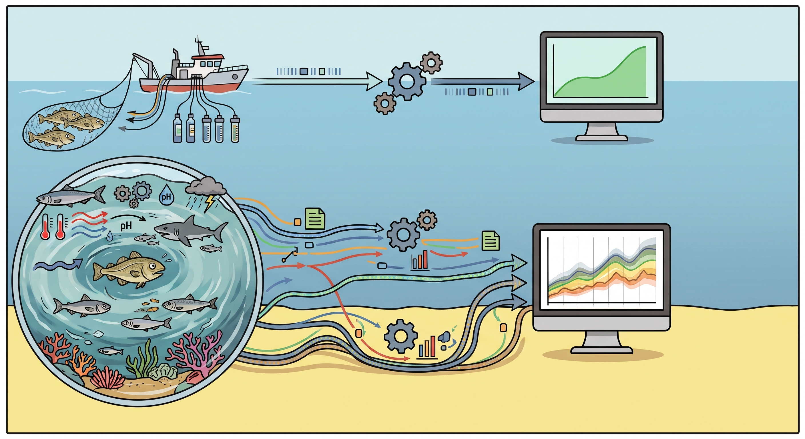
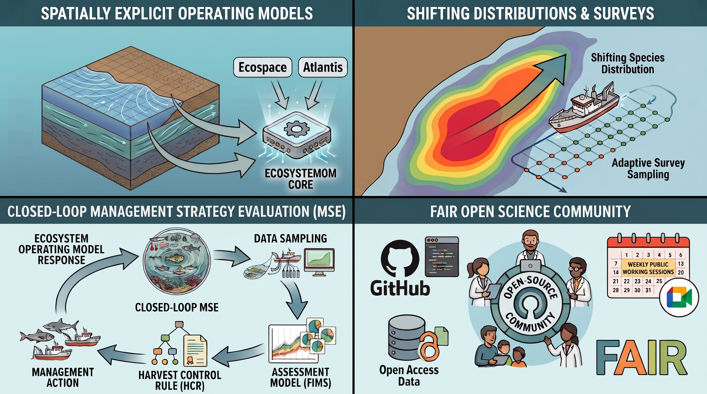

layout: true

<style>
.progress-bar {
  position: fixed; left: 0; right: 0; bottom: 0;
  height: 8px; background-color: #0085CA; z-index: 100;
}

.left-wide {
  width: 65%;
  float: left;
}

.right-narrow {
  width: 30%;
  float: right;
}
</style>
  
```{r xaringanthemer, include=FALSE, warning=FALSE}
required_pkg <- c("xaringanthemer", "remotes", "webshot2", "xfun")
pkg_to_install <- required_pkg[!(required_pkg %in%
                                   installed.packages()[, "Package"])]
if (length(pkg_to_install)) install.packages(pkg_to_install)
lapply(required_pkg, library, character.only = TRUE)

remotes::install_github("NOAA-FIMS/ecosystemom")
remotes::install_github("nmfs-ost/nmfspalette")
library(ecosystemom)
library(nmfspalette)

style_xaringan(

  base_font_size = "15px",
  text_font_size = "1.5rem",

  title_slide_background_color = unname(nmfs_cols("darkblue")),
  title_slide_text_color = unname(nmfs_cols("white")),
  title_slide_background_size = "cover",
  title_slide_background_image = file.path("static", "slideswooshver.png"),

  background_image = file.path("static", "slideswoosh_16_9.PNG"),
  background_size = "cover",
  background_color = unname(nmfs_cols("white")),

  header_font_google = google_font("Arimo"),
  header_color = unname(nmfs_cols("darkblue")),

  text_color = unname(nmfs_cols("darkblue")),
  text_slide_number_color = unname(nmfs_cols("lightteal")),

  code_font_google = google_font("Source Code Pro"),
  code_highlight_color = unname(nmfs_cols("medteal")),

  inverse_background_color = unname(nmfs_cols("processblue")),
  inverse_text_color = unname(nmfs_cols("supltgray")),

  footnote_font_size = "0.6em",
  footnote_color = unname(nmfs_cols("darkblue")),
  footnote_position_bottom = "10px",

  link_color = unname(nmfs_cols("medteal")),


  extra_css = list(
    ".remark-slide-number" = list(
      "font-size" = "0.5em",
      "font-weight" = "bold",
      "bottom" = "10px",
      "right" = "300px",
      "margin" = "0px"
      ),

    ".title-slide h1, h2, h3" = list(
      "text-align" = "right"), 
    
    ".hyperlink-style" = list(
      "color" = "blue")
  )
)
```

.footnote[U.S. Department of Commerce | National Oceanic and Atmospheric Administration | National Marine Fisheries Service]

```{r setup, include=FALSE}
options(htmltools.dir.version = FALSE)
```

---
# Outline

- Single-Species Advice in Dynamic Ecosystems
- Overview of {ecosystemom}
- End-to-End Simulation Case Study
- Lessons Learned: Surveys, Natural Mortality, and Environmental Drivers
- Future Directions

---
# Single-Species Advice in Dynamic Ecosystems

- Single-species assessments remain central to tactical fisheries management worldwide
- Current testing may suggest robust performance when using single-species operating models (OMs)
- Real-world fish stocks inhabit dynamic oceans driven by environmental forcing and changing trophic interactions
- The key gap is integration: connecting ecosystem models to tactical stock assessment tools

```{r single-species-advice-in-dynamic-ecosystems, echo=FALSE, out.width="50%", fig.align="center"}

```

.footnote[
Figure generated by Gemini 3.6, Google, September 2026
]
---

# Overview of {ecosystemom}

.pull-left-75[

- Build a flexible ecosystem-to-stock-assessment simulation framework within the open-source .hyperlink-style[[NOAA Fisheries Integrated Modeling System](https://noaa-fims.github.io/)] (FIMS)

  - 🧪 Test FIMS using ecosystem models as OMs

  - 🔍 Explore ecosystem-informed stock assessment approaches

  - 🤝 Create interdisciplinary research and collaboration opportunities
  
- Current and planned ecosystem modeling platform support

<div style="display: flex; align-items: flex-end; justify-content: space-evenly; text-align: center; margin-top: 20px;">
  
  <!-- Logo 1 -->
  <div style="display: flex; flex-direction: column; align-items: center;">
    
    <span style="margin-top: 10px; font-weight: bold;">Ecopath with Ecosim (EwE)</span>
  </div>

  <!-- Logo 2 -->
  <div style="display: flex; flex-direction: column; align-items: center;">
    
    <span style="margin-top: 10px; font-weight: bold;">Atlantis</span>
  </div>

  <!-- Logo 3 -->
  <div style="display: flex; flex-direction: column; align-items: center;">
    
    <span style="margin-top: 10px; font-weight: bold;">Rpath</span>
  </div>

</div>
  
]

.pull-right-25[
```{r fims-logo, echo=FALSE, fig.align='center', out.width='70%'}
knitr::include_graphics(file.path("static", "FIMS_hexlogo.png"))
```
]

.clear[]

.footnote[
[1] .hyperlink-style[[FIMS Website: https://noaa-fims.github.io/FIMS/](https://noaa-fims.github.io/FIMS/)]<br>
[2] .hyperlink-style[[ecosystemom Website: https://noaa-fims.github.io/ecosystemom/](https://noaa-fims.github.io/ecosystemom/)]
]
---

# Overview of {ecosystemom}

- `load_model()`: Import and standardize outputs from ecosystem OMs

- `get_truth()`: Extract “true” population quantities from OMs

- `sample_*()`: Generate sampled observations from OM outputs for use in fisheries stock assessment models such as FIMS

- `create_dsem_inputs()`: Prepare environmental covariates or diet composition data from the OM to support candidate model specifications for dynamic structural equation models (DSEMs)

```{r my-figure, echo=FALSE, message=FALSE, out.width="60%", fig.align="center"}
data <- ecosystemom::ewe_ecosim_base_nwatlantic
truth <- ecosystemom::get_truth(data, species_name = "menhaden")

truth |>
  dplyr::filter(truth_time_step == "yearly") |> 
  dplyr::filter(
    (truth_type == "index" & truth_label %in% c("biomass", "catch", "fishing_mortality")) |
    (truth_type == "agecomp" & truth_label %in% c("catch", "natural_mortality", "numbers"))
  ) |>
  dplyr::mutate(
    truth_om = sapply(truth_om, function(x) paste0("<tibble [", nrow(x), " × ", ncol(x), "]>"))
  ) |>
  knitr::kable(
    align = "l",
    format = "html"
  ) |>
  kableExtra::kable_styling(font_size = 14)
```

---
# End-to-End Simulation Case Study

- Ecosystem: Northwest Atlantic EwE Ecosim model (Adapted from Chagaris et al., 2020)

- Focal stock: Atlantic menhaden-like species

- OM scenarios:
  - Scenario 1 (S1): base scenario without environmental forcing
  - Scenario 2 (S2): environmental forcing scenario

- Estimation model (EM): FIMS 

.footnote[
.hyperlink-style[[Chagaris, D., Drew, K., Schueller, A., Cieri, M., Brito, J., and Buchheister, A. 2020. Ecological reference points for Atlantic menhaden established using <br> an ecosystem model of intermediate complexity. Frontiers in Marine Science, 7:606417. 10.3389/fmars.2020.606417.](https://doi.org/10.3389/fmars.2020.606417)]<br>
]

---
# Lessons Learned #1: Sample Size vs. Survey Types

- Increasing age composition sample size did not fix non-convergence in the EM

- Simulating a dedicated Young-of-Year survey index improved model fits and recruitment tracking

.pull-left[
```{r recruitment-without-yoy, echo=FALSE, fig.align='center', out.width='90%'}
knitr::include_graphics(file.path("static", "ecosystemom_atlantic_menhaden_recruitment_without_yoy.png"))
```
]

.pull-right[
```{r recruitment-with-yoy, echo=FALSE, fig.align='center', out.width='90%'}
knitr::include_graphics(file.path("static", "ecosystemom_atlantic_menhaden_recruitment_with_yoy.png"))
```
]

**{ecosystemom} provides a testbed to evaluate alternative survey designs**

---
# Lessons Learned #2: Perfectly Known Natural Mortality

- Passing the "true" time-varying and age-varying natural mortality (M) matrix from the OM (S1) yielded matching estimates

- Assuming perfectly known time-varying M is not applicable to real-world assessments

.pull-left[
```{r biomass, echo=FALSE, fig.align='center', out.width='90%'}
knitr::include_graphics(file.path("static", "ecosystemom_atlantic_menhaden_biomass_comparison.png"))
```
]

.pull-right[
```{r fishing-mortality, echo=FALSE, fig.align='center', out.width='90%'}
knitr::include_graphics(file.path("static", "ecosystemom_atlantic_menhaden_fishing_mortality_comparison.png"))
```
]

**{ecosystemom} provides a testbed to explore parameter and process misspecifications**

---
# Lessons Learned #3: Incorporating Environmental Drivers

- Implementing DSEM in FIMS is currently a work in progress

- Active environmental forcing (S2) in the OM creates parameter estimation challenges when the EM lacks explicit environmental driver incorporation

```md

⚠️ FIMS Warning ⚠️

#> Warning: ! Large condition number detected in Hessian; the matrix may be near singular.
#> ℹ Condition number of Hessian ("1.406917e+05") exceeds threshold of 1e+05.
#> ℹ This suggests the model is weakly identified and results may be unreliable.
#> ℹ Consider simplifying the model, improving data quality, or fixing poorly
#>   informed parameters.
#> ℹ The 2 largest standard error values are for parameters:
#> ℹ 1. "expected_recruitment": "8.273532e+09"
#> ℹ 2. "numbers_at_age": "8.273532e+09"
```
**{ecosystemom} provides a testbed to evaluate how to best incorporate climate and ecosystem information into stock assessment models**

---
# Future Directions 

```{r future-directions, echo=FALSE, out.width="70%", fig.align="center"}

```

🤝 To contribute or share feedback on {ecosystemom}, visit the repository or email Bai Li at bai.li@noaa.gov.

.footnote[
Figure generated by Gemini 3.6, Google, September 2026
]

???
- Expanding {ecosystemom} to ingest spatially explicit operating models like Ecospace and Atlantis

- Simulating spatial survey sampling and index generation under shifting species distributions

- Coupling single-species assessments into closed-loop Management Strategy Evaluations to test climate-ready harvest control rules

- Continuing to build on FAIR open-science principles through transparent, community-driven development, and weekly public working sessions

```{js, echo=FALSE}
(function() {
  var bar = document.createElement('div');
  bar.className = 'progress-bar';
  document.querySelector('.remark-slides-area').appendChild(bar);

  slideshow.on('afterShowSlide', function(slide) {
    var count = slideshow.getSlideCount();
    var index = slide.getSlideIndex();
    bar.style.width = (index / (count - 1) * 100) + '%';
  });
})();
```

```{css, echo=FALSE}
.pull-left-75 {
  float: left;
  width: 75%;
}
.pull-right-25 {
  float: right;
  width: 25%;
}
.clear {
  clear: both;
}
```